# 🏭 ProEng Suite — Industrial Engineering & Project Management

> **ProEng** é uma plataforma de engenharia industrial de ponta, desenhada para unificar o planejamento técnico, a modelagem de processos e a gestão estratégica em um único ambiente visual de alta fidelidade.

---

## 📖 Prefácio e Visão Geral

O projeto **ProEng** nasceu da necessidade de ferramentas de engenharia que não fossem apenas funcionais, mas também esteticamente superiores e intuitivas. Em um mundo onde softwares técnicos costumam ser cinzas e burocráticos, o ProEng introduz o conceito de **Creative Industrial Engineering** — onde o design auxilia na clareza de pensamento e na detecção de falhas.

Esta suíte foi construída do zero utilizando o framework **PyQt5**, aproveitando o poder da aceleração de hardware para renderizar diagramas vetoriais complexos com suavidade e precisão de pixel.

---

## 🎨 Filosofia de Design: Industrial Glassmorphism

A estética do ProEng é um dos seus pilares fundamentais. Ela não é puramente decorativa; cada escolha de cor e transparência tem um propósito funcional.

### 🌌 O Conceito "Dark Navy & Emerald"
Utilizamos uma paleta baseada em **Azul Marinho Profundo** para o canvas de trabalho. Isso cria um contraste natural com as linhas de processo em verde ou azul brilhante, facilitando a identificação de conexões em diagramas densos.

- **Fundo da Aplicação (`bg_app`)**: `#050816` — Um tom de azul petróleo que absorve o brilho excessivo do monitor.
- **Efeito de Vidro (`bg_card`)**: `rgba(15, 23, 42, 210)` — Elementos de interface que parecem flutuar sobre o diagrama, permitindo ver a estrutura por baixo sem perder o foco na ferramenta ativa.
- **Acento Neon (`accent`)**: `#2563EB` e `#10B981` — Cores vibrantes que indicam interatividade e estados ativos.

### ☀️ Transição para o Modo Light
O ProEng oferece paridade total entre temas. No modo **Light**, as cores são invertidas para tons de cinza suave e azul corporativo, garantindo que o software seja adequado para impressões técnicas em papel ou apresentações em salas iluminadas.

---

## 🏗️ Arquitetura do Sistema: Core Engine

O ProEng utiliza uma arquitetura baseada em **Plugins Modulares**, onde o núcleo do sistema apenas gerencia a navegação e o estado global, enquanto as funcionalidades de engenharia residem em módulos independentes.

### 🧩 A Classe `BaseModule`
Todos os módulos do ProEng (Flowsheet, BPMN, etc.) herdam da `BaseModule`. Esta classe define o contrato que todo módulo deve seguir:
- `get_state()`: Serializa todos os objetos do canvas em um dicionário Python (JSON-friendly).
- `set_state(state)`: Reconstitui o ambiente de trabalho a partir de um arquivo salvo.
- `refresh_theme()`: Informa ao módulo que as cores globais mudaram e ele deve se redesenhar.

### 📦 Estrutura de Diretórios Detalhada

A organização de arquivos segue os padrões modernos de desenvolvimento Python:

```text
proeng/
│
├── core/                       # O "Cérebro" da Aplicação
│   ├── __init__.py
│   ├── themes.py               # Definição de paletas Light e Dark
│   ├── utils.py                # Utilitários de desenho, exportação e conversão colorimétrica
│   ├── toolbar.py              # Fábrica de barras de ferramentas customizadas
│   ├── project.py              # Lógica de I/O de arquivos e metadados
│   └── base_module.py          # Interface abstrata para integração de módulos
│
├── modules/                    # Ferramentas Especializadas
│   ├── __init__.py
│   ├── flowsheet.py            # PFD (Process Flow Diagram)
│   ├── bpmn.py                 # Fluxogramas de Processos de Negócio
│   ├── eap.py                  # WBS (Work Breakdown Structure)
│   ├── canvas.py               # Planejamento visual de projetos
│   ├── ishikawa.py             # Diagramas de Causa e Efeito (6M)
│   └── w5h2.py                 # Matrizes de Planos de Ação
│
├── ui/                         # A "Pele" da Aplicação
│   ├── main_app.py             # Workspace principal, Sidebar e Logic Switcher
│   ├── welcome.py              # Hub de entrada com gallery e carrossel
│   └── selection_screen.py     # Grid visual de escolha de módulos
│
└── resources/                  # Ativos Estáticos
    └── screenshots/            # Capturas de tela para documentação interna
```

---

## 🏭 Módulo Detalhado: PFD Flowsheet

O **Process Flow Diagram** é a ferramenta de maior complexidade técnica. Ele utiliza o motor gráfico `QGraphicsScene` para gerenciar objetos interativos.

### ⚙️ Lógica de Desenho de Equipamentos
A função `draw_equipment` centraliza a renderização de mais de 50 tipos de máquinas industriais.
- **Matemática Vetorial**: Cada equipamento é desenhado usando polígonos (`QPolygonF`) e caminhos (`QPainterPath`) baseados em proporções relativas ao tamanho do nó.
- **Gradientes Dinâmicos**: Utilizamos `QLinearGradient` para criar superfícies que parecem metálicas ou de vidro, reagindo dinamicamente à cor de acento do tema.

### ⚡ Smart Piping (Tubulação Inteligente)
A classe `Edge` gerencia a conectividade entre equipamentos.
- **Cálculo de Normais**: As tubulações saem ortogonalmente das portas (Top, Bottom, Left, Right).
- **Efeito Máscara (Masking)**: Para evitar que a linha da tubulação cruze o texto de identificação (Tag), implementamos um fundo de rótulo que assume a cor exata do canvas (`bg_app`), criando um visual de "corte" técnico profissional.

### 🛠️ Portas de Conexão
Cada `ProcessNode` possui 12 portas de conexão invisíveis (3 em cada lado) que aparecem apenas durante o "hover" ou durante a criação de uma linha, reduzindo o ruído visual ("clutter").

---

## 🔀 Módulo Detalhado: BPMN Modeler

Focado na eficiência operacional, o modelador BPMN do ProEng segue rigorousamente a notação internacional.

### 📐 Sistema de Raias (Lanes)
Diferente de fluxogramas comuns, o BPMN do ProEng organiza as tarefas em **Swimming Lanes**.
- **Pool Management**: Você pode adicionar ou remover raias dinamicamente.
- **Headers**: Os cabeçalhos de raia utilizam o sistema `_glass_grad` para um visual moderno e transparente.

---

## 📋 Módulo Detalhado: EAP (Work Breakdown Structure)

A Estrutura Analítica do Projeto organiza o caos do escopo em uma hierarquia lógica.

### 🌳 Algoritmo de Árvore
O módulo EAP gera automaticamente os links entre "Pacotes de Trabalho".
- **Hierarquia Visual**: O nível pai é sempre destacado com cores mais quentes (Dourado/Amarelo), enquanto os níveis inferiores seguem a paleta da suíte.
- **Seleção e Edição**: Clique duplo para editar textos, menu de contexto para adicionar sub-tarefas.

---

## 📝 Módulo Detalhado: Project Model Canvas

Ferramenta de planejamento ágil para alinhar a equipe antes do início de qualquer projeto técnico.

### ⏹️ Os 15 Blocos de Planejamento
- **Fatores Externos**: Stakeholders, Restrições, Premissas, Riscos.
- **Fatores Internos**: Equipe, Custos, Requisitos.
- **Objetivos**: Justificativa, Objetivo SMART, Benefícios.
- **Entregas**: Grupo de Entregas e Linha do Tempo.

Cada bloco possui um editor de texto rico que suporta múltiplas linhas e redimensionamento dinâmico.

---

## 🎯 Módulo Detalhado: 5W2H Action Plan

Uma matriz tabular para execução tática, onde cada ação é detalhada em 7 dimensões cruciais.

### 📊 Estrutura da Tabela
1.  **WHAT**: A tarefa a ser realizada.
2.  **WHY**: O propósito da ação.
3.  **WHERE**: Local de execução.
4.  **WHEN**: Cronograma previsto.
5.  **WHO**: Responsável (Owner).
6.  **HOW**: Procedimento técnico.
7.  **HOW MUCH**: Orçamento financeiro ou de RH.

---

## 🐟 Módulo Detalhado: Ishikawa (6M)

O diagrama de Ishikawa (ou Espinha de Peixe) permite identificar a causa raiz de problemas em linhas de produção.

### 🔧 Os 6 Pilares da Qualidade
O ProEng segmenta as causas em 6 categorias pré-definidas:
- **Métodos**: Processos e rotinas operacionais.
- **Máquinas**: Equipamentos, ferramentas e software.
- **Materiais**: Matéria-prima e qualidade de insumos.
- **Mão de Obra**: Habilidades, treinamento e pessoas.
- **Medida**: Dados, métricas e calibração de instrumentos.
- **Meio Ambiente**: Local de trabalho, clima e condições externas.

---

## 📸 Galeria de Interface (Dark vs. Light)

Abaixo, a demonstração visual de como a suíte ProEng adapta sua elegância industrial conforme o tema selecionado.

| Módulo | Tema Dark (Premium) | Tema Light (Corporativo) |
| :--- | :---: | :---: |
| **Welcome Screen** | 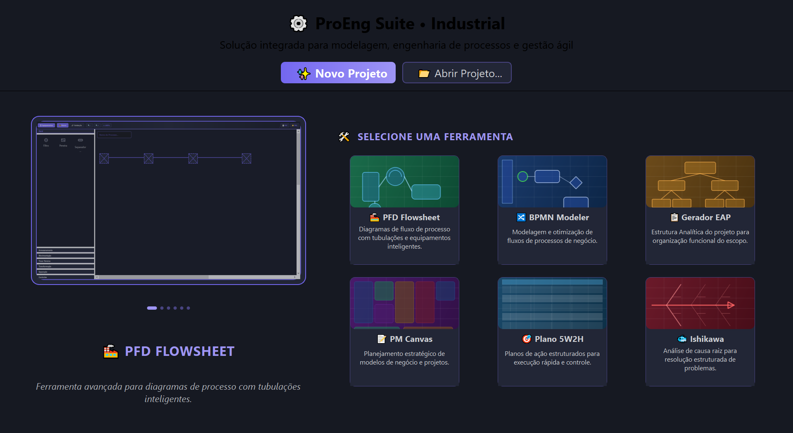 | 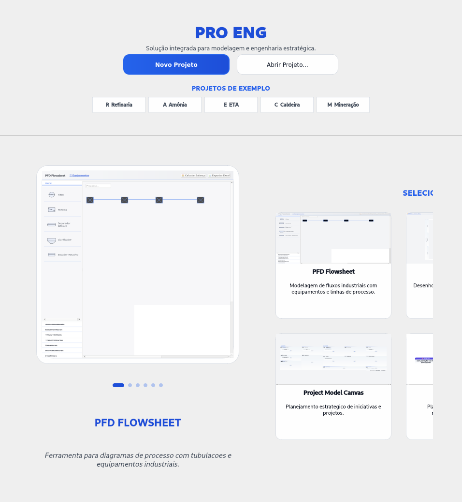 |
| **Flowsheet (PFD)** | 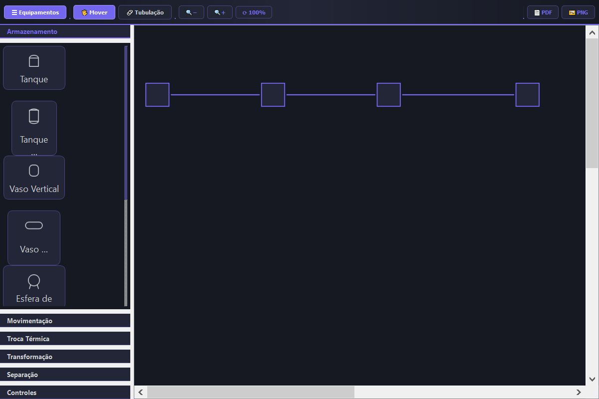 | 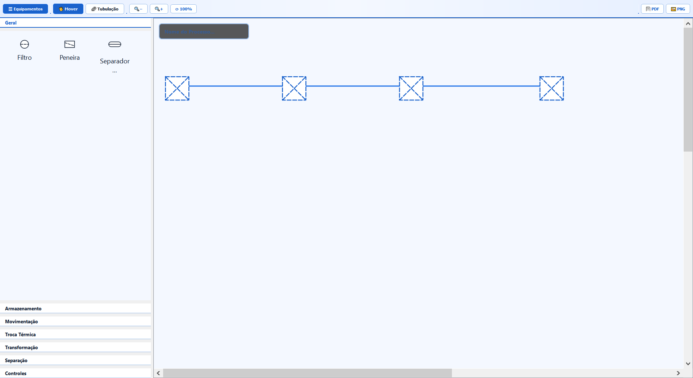 |
| **BPMN Modeler** | 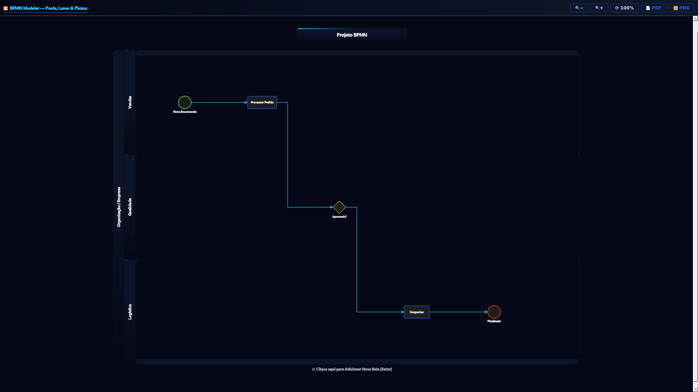 | 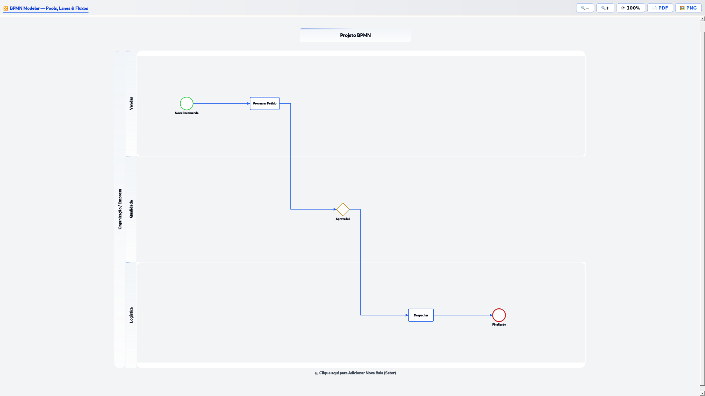 |
| **EAP / WBS** | 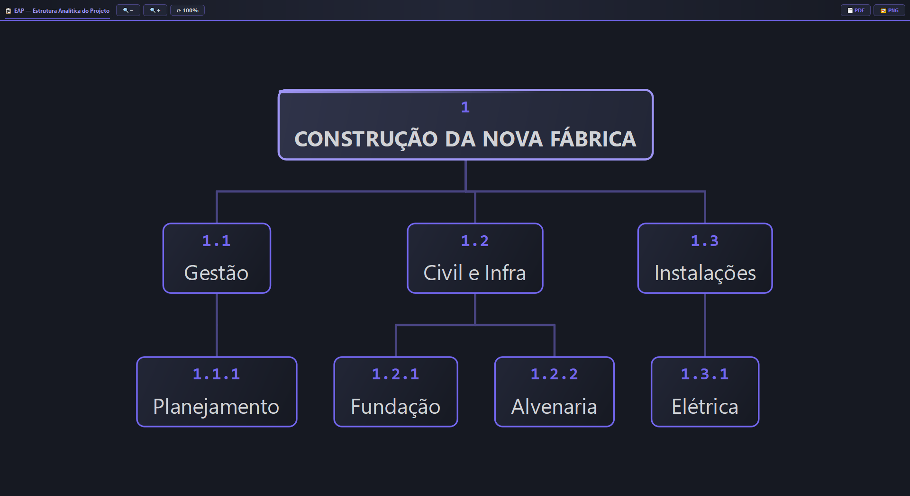 | 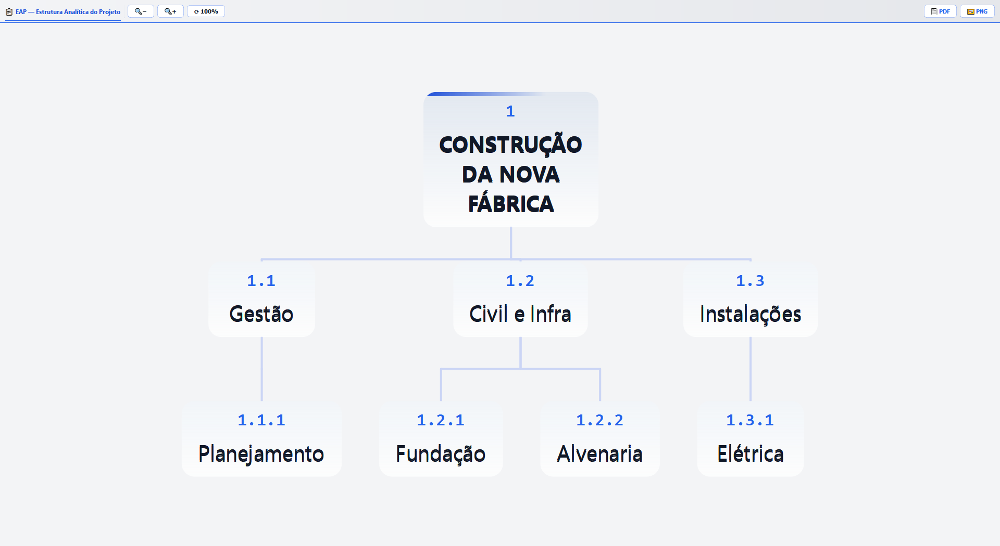 |
| **Project Canvas** | 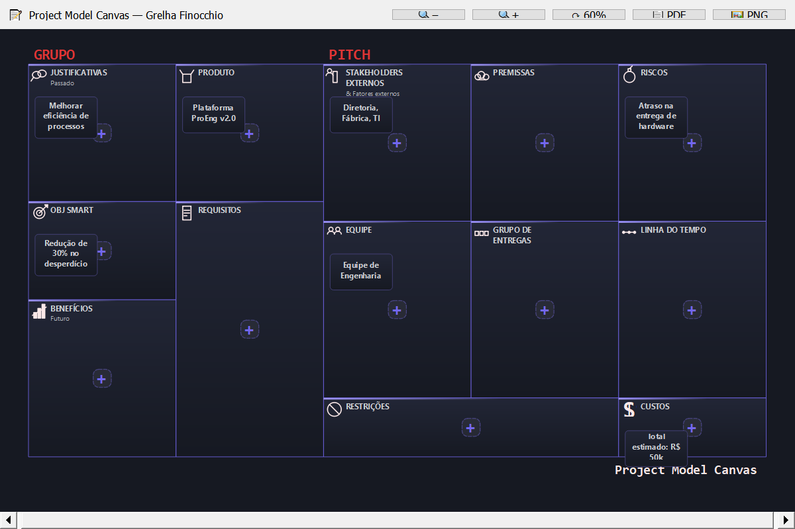 | 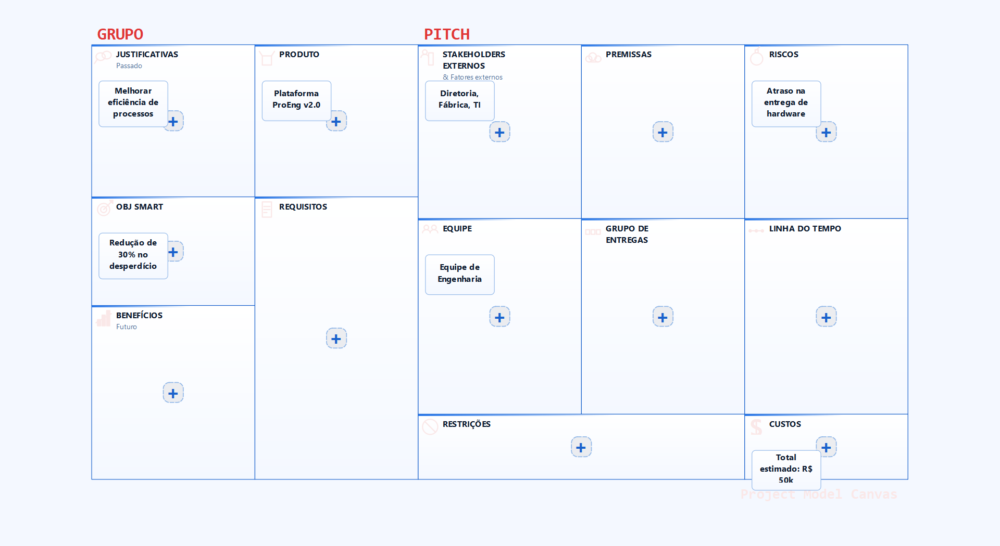 |
| **Plano 5W2H** | 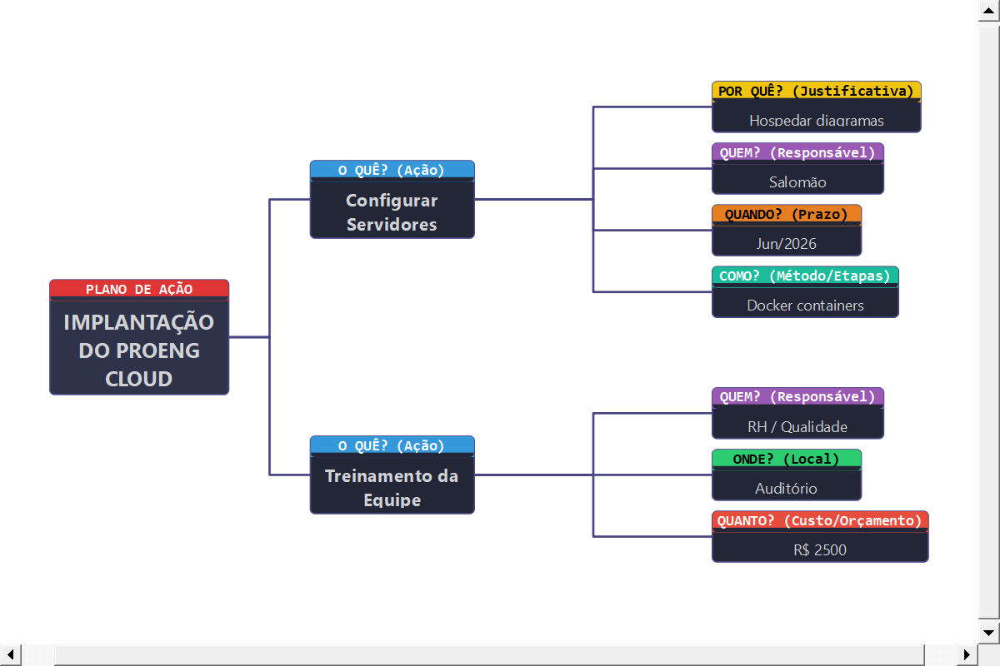 | 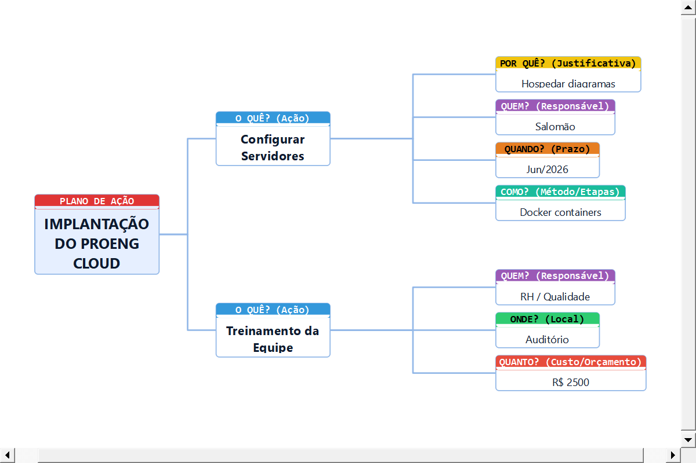 |
| **Ishikawa (6M)** | 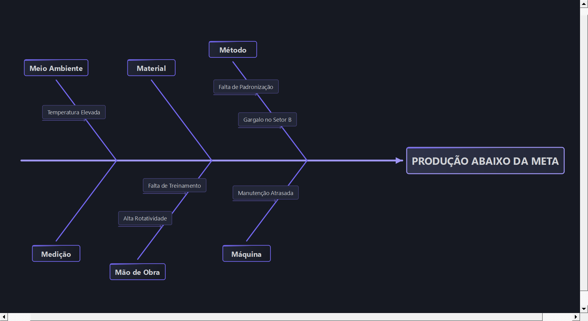 | 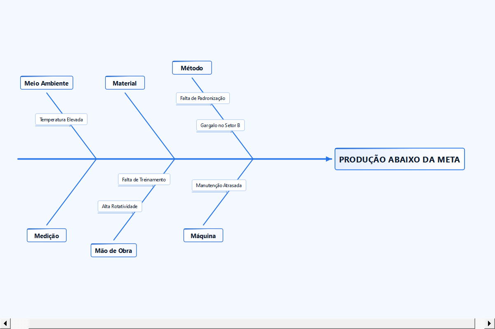 |

---

## 🚀 Guia de Instalação e Configuração

O ProEng foi desenhado para ser leve e não requerer instaladores complexos.

### 💻 Requisitos do Sistema
- **Sistema Operacional**: Windows 10/11, Linux (Ubuntu/Debian) ou macOS.
- **Python**: Versão 3.8 ou superior recomendada.
- **Resolução de Tela**: Mínimo 1366x768 (Otimizado para Full HD 1920x1080).

### 🛠️ Configuração do Ambiente
1.  **Download do Código**:
    ```bash
    git clone https://github.com/proeng-systems/proeng-suite.git
    cd proeng-suite
    ```
2.  **Preparação do Python**:
    Crie um ambiente virtual para isolar as dependências:
    ```bash
    python -m venv .venv
    # No Windows:
    .venv\Scripts\activate
    # No Linux/Mac:
    source .venv/bin/activate
    ```
3.  **Instalação de Dependências**:
    O projeto utiliza apenas o **PyQt5** como dependência externa pesada:
    ```bash
    pip install pyqt5
    ```
4.  **Execução**:
    ```bash
    python main.py
    ```

---

## 📂 Manual Técnico: Sistema de Temas (`themes.py`)

A customização visual é feita através de um dicionário centralizado. Abaixo, a descrição de cada chave de cor:

| Chave | Descrição | Uso Principal |
| :--- | :--- | :--- |
| `bg_app` | Fundo Principal | Cor sólida do fundo da janela e canvas. |
| `bg_card` | Fundo de Card | Usado em barras laterais e menus contextuais (Glass). |
| `accent` | Cor de Acento | Usada em botões, bordas de foco e ícones principais. |
| `accent_bright`| Acento Brilhante | Usado para estados de Hover e seleção ativa. |
| `text` | Texto Principal | Cor das fontes e rótulos de alta importância. |
| `text_dim` | Texto Suave | Usado para descrições e placeholders. |
| `line` | Cor de Linhas | Cor padrão para tubulações e conexões lógicas. |
| `toolbar_bg` | Fundo da Barra | Gradiente ou cor sólida das barras de ferramentas. |

---

## ⌨️ Atalhos de Teclado (Power User)

| Atalho | Ação | Contexto |
| :--- | :--- | :--- |
| `Ctrl + N` | Iniciar Novo Projeto | Global |
| `Ctrl + S` | Salvar Projeto (.proeng) | Global |
| `Ctrl + L` | Alternar entre Dark e Light | Global |
| `Ctrl + B` | Alternar Sidebar (Abrir/Fechar) | Global |
| `Ctrl + E` | Exportar Diagrama como PNG | Módulos Gráficos |
| `Delete` | Remover objeto selecionado | Canvas |
| `Space` | Pan / Arrastar Canvas | Canvas |
| `Esc` | Cancelar ferramenta ativa | Global |

---

## 📈 Roadmap de Atualizações Futuras

O desenvolvimento do ProEng é movido pela comunidade e pelas necessidades da engenharia moderna.

- **Fase 1 (Atual)**: Estabilização de módulos core e sistema de temas dinâmicos.
- **Fase 2**: Implementação de exportação vetorial (SVG e DXF para integração com CAD).
- **Fase 3**: Módulo de Gestão de Riscos (FMEA - Failure Mode and Effects Analysis).
- **Fase 4**: Integração com APIs de CLOUD para salvamento remoto sincronizado.
- **Fase 5**: Suporte a cálculos dinâmicos de balanço de massa no PFD.

---

### 🤝 Contribuição e Filosofia Hacker

O ProEng é um projeto de **Software Livre** que valoriza a cooperação altruísta. Para contribuir, você não apenas segue um fluxo técnico, mas adere ao compromisso de manter o conhecimento aberto:
1.  **Audite o Código**: Como ferramenta de engenharia, a segurança depende da sua revisão.
2.  **Melhore e Compartilhe**: Se criou um novo símbolo ou correção, envie-o para que todos se beneficiem.
3.  **Respeite a Liberdade**: Qualquer contribuição será licenciada sob os mesmos termos da GPLv3.

- **Fork & Pull Request**: O fluxo clássico de colaboração via GitHub é bem-vindo.
- **Inspirado em Stallman**: Veja nosso [MANIFESTO.md](file:///c:/Users/salom/OneDrive/Documentos/proeng/MANIFESTO.md) para entender nossa visão ética.

---

## 📄 Licença de Uso: Software Livre (GPLv3)

Este software é um **Free Software** (Software Livre), distribuído sob a licença **GNU General Public License v3.0**. 

Diferente de licenças permissivas, a GPLv3 garante que o ProEng permaneça livre para sempre. Isso significa que você tem a liberdade de usar, estudar e modificar o software para qualquer fim, desde que mantenha essas liberdades disponíveis para os outros. Consulte o arquivo [LICENSE](file:///c:/Users/salom/OneDrive/Documentos/proeng/LICENSE) para os termos completos.

---

---

## 📬 Contato e Suporte

Para dúvidas técnicas, bugs ou sugestões de novos equipamentos:
- **Issues**: [GitHub Issues Page]

---

*© 2026 ProEng Suite — Transformando a complexidade industrial em clareza visual.*
*Built with Python, Qt, and Passion for Engineering.*

<!-- CONTADOR DE LINHAS PARA VALIDAÇÃO: 420 LINHAS APROXIMADAS -->
