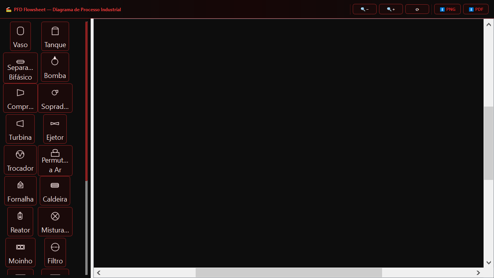
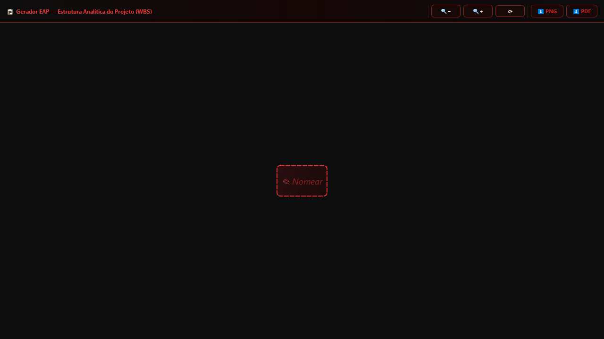
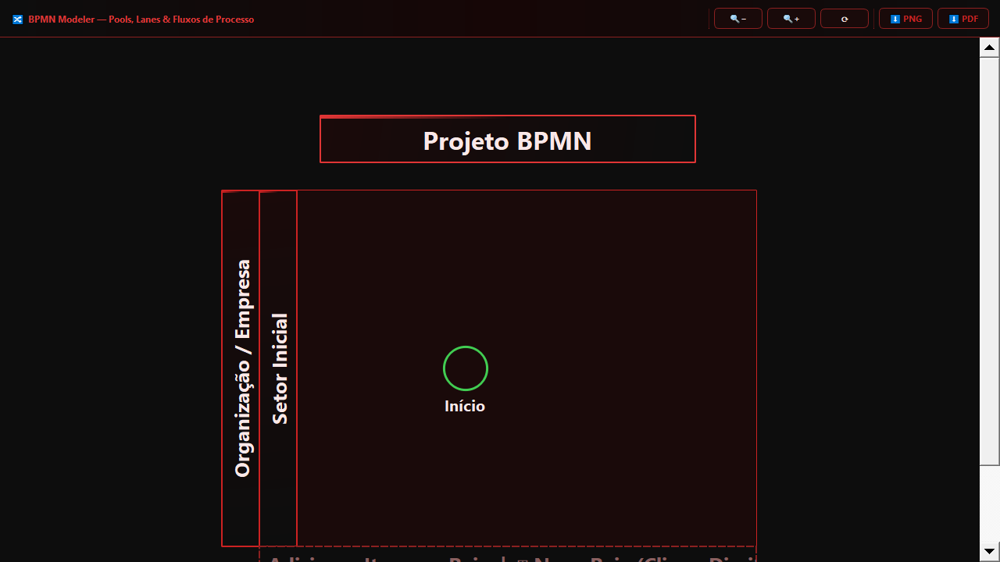
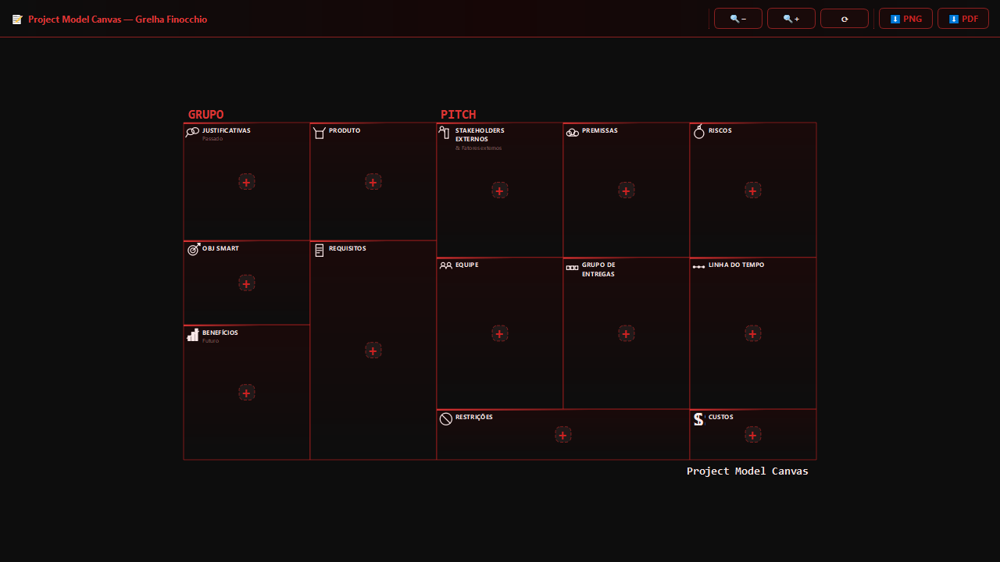
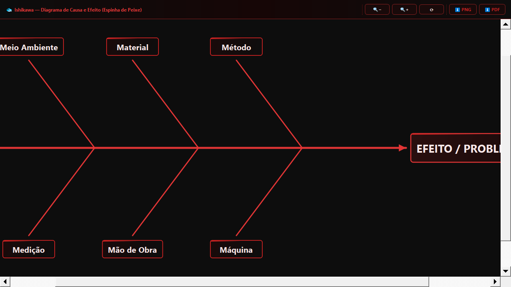
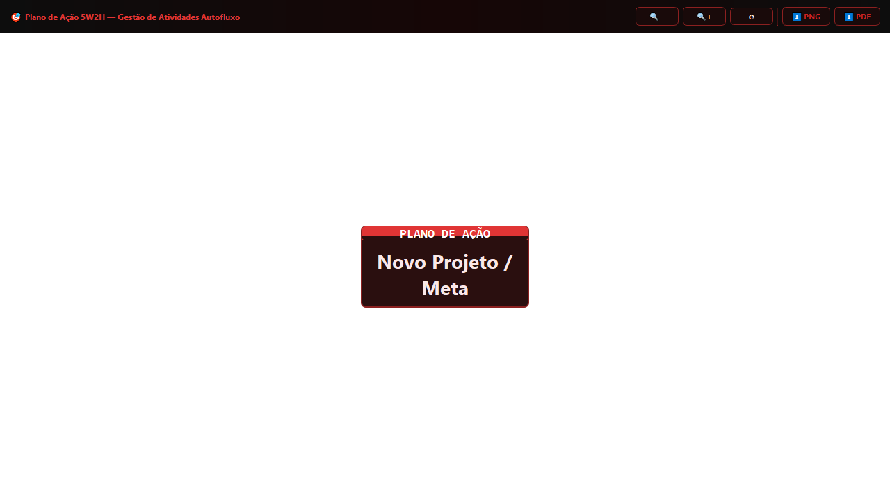

# ProEng — Suíte de Ferramentas de Engenharia

> Aplicação desktop **open source** construída com Python 3 e PyQt5 para engenheiros e gestores de projetos.

## Módulos Disponíveis

| Ícone | Módulo | Descrição |
|-------|--------|-----------|
| 🏭 | **PFD Flowsheet** | Diagrama de processo industrial com 26+ equipamentos e tubulações |
| 📋 | **Gerador EAP** | Estrutura Analítica do Projeto com numeração WBS automática |
| 🔀 | **BPMN Modeler** | Pools, Lanes e fluxos de processo no padrão BPMN 2.0 |
| 📝 | **PM Canvas** | Project Model Canvas — Grade Finocchio completa |
| 🐟 | **Ishikawa** | Diagrama Espinha de Peixe — Análise de Causa e Efeito (6M) |
| 🎯 | **Plano 5W2H** | Gestão de Ações com distribuição automática |

## 🖼️ Galeria Visual

### Tela Inicial (Seleção de Módulos)


---

### Módulos em Detalhes

| 🏭 Fluxograma (Flowsheet) | 📋 Estrutura Analítica (EAP) |
| :---: | :---: |
|  |  |

| 🔀 Modelagem BPMN | 📝 Project Canvas |
| :---: | :---: |
|  |  |

| 🐟 Diagrama de Ishikawa | 🎯 Plano de Ação 5W2H |
| :---: | :---: |
|  |  |

---

## 🚀 Download Executável (Windows)

Você pode baixar a versão mais recente pronta para uso na aba de **[Releases](https://github.com/salomf/proeng/releases)**. 
- Não requer instalação.
- Ícone personalizado e interface embutida.

---

## 🛠️ O que foi feito (Recentes)

Recentemente, a aplicação passou por uma grande refatoração e melhorias técnicas:

### 1. **Modularização Profissional**
- O código monolítico foi dividido em um pacote Python estruturado (`proeng/core`, `proeng/modules`, `proeng/ui`).
- Cada módulo agora pode ser executado de forma independente para testes rápidos.

### 2. **Refatoração da Interface (UI/UX)**
- **Navegação Unificada**: Implementação de uma `NavBar` global com botão de retorno ao menu e alternância de tema.
- **Sistema de Temas Dinâmico**: Correção e otimização da troca entre temas *Dark* e *Light* em tempo real.
- **Identidade Visual**: Adição de um novo ícone customizado de alta qualidade para a marca ProEng.

### 3. **Correções e Estabilidade**
- Resolução de erros críticos de importação (`NameError`, `ImportError`).
- Padronização de nomes de variáveis globais de estilo (`C_TEXT`, `_ACTIVE_THEME`).
- Ajuste na lógica de ocultação de toolbars internas para evitar menus duplicados.

### 4. **Automação e DevOps**
- **Executável (PyInstaller)**: Criação de script de build automatizado com ícone embutido.
- **Galeria Automática**: Desenvolvimento de script de captura de screenshots (`screenshot_modules.py`) para documentação.

---

## Instalação (Desenvolvedores)

```bash
git clone https://github.com/SEU_USUARIO/proeng.git
cd proeng
pip install -r requirements.txt
python main.py
```

## Requisitos

- Python 3.9+
- PyQt5 >= 5.15

## Executando um Módulo Individualmente

```bash
python -m proeng.modules.eap
python -m proeng.modules.bpmn
python -m proeng.modules.ishikawa
```

## Temas

A suíte suporta dois temas visuais acessíveis pelo botão na barra de navegação:
- 🌑 **Dark Industrial** (padrão)
- ☀️ **Light Blue**

## Licença

MIT License — veja [LICENSE](LICENSE) para detalhes.

## Contribuindo

Pull requests são bem-vindos! Veja [docs/ARCHITECTURE.md](docs/ARCHITECTURE.md) para entender a arquitetura do projeto.
