# Tutoriais do ProEng

Este documento fornece guias passo a passo para utilizar cada módulo do ProEng, além de dicas, exemplos práticos e informações de troubleshooting.

---

## Galeria Visual

Capturas geradas no tema Solar, preservando a linguagem neo-brutalista do ProEng.

### Página Inicial

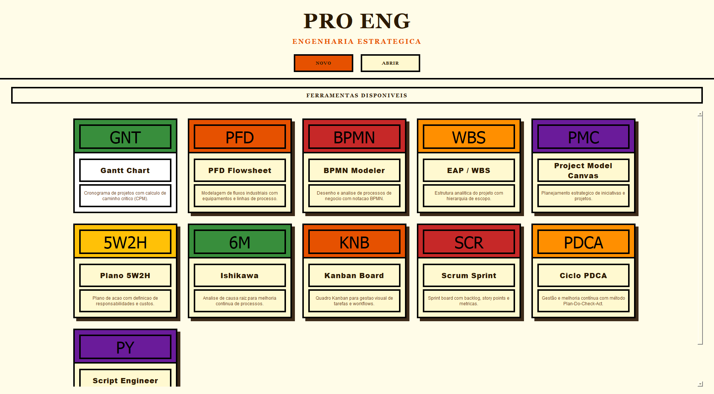

### Flowsheet

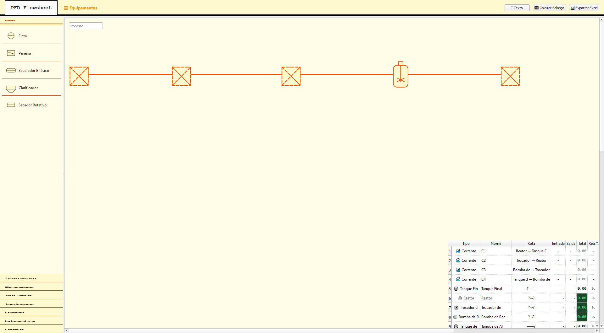

### BPMN

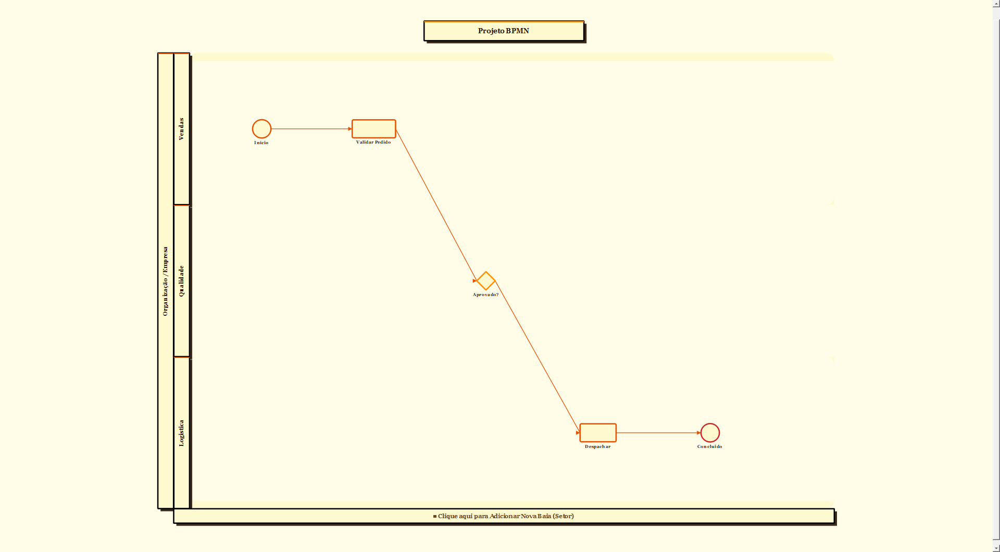

### EAP / WBS

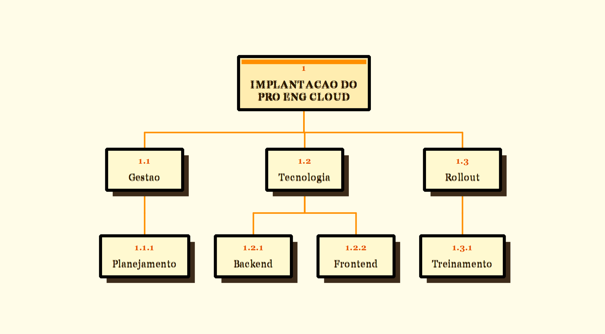

### PM Canvas

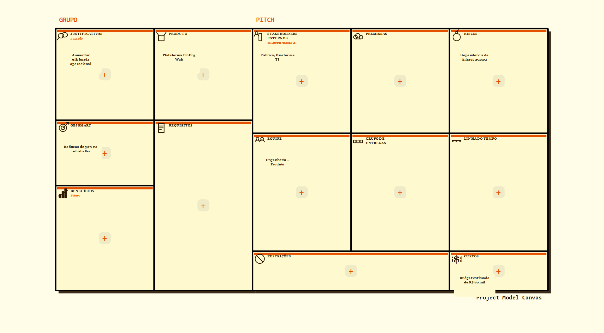

### Ishikawa

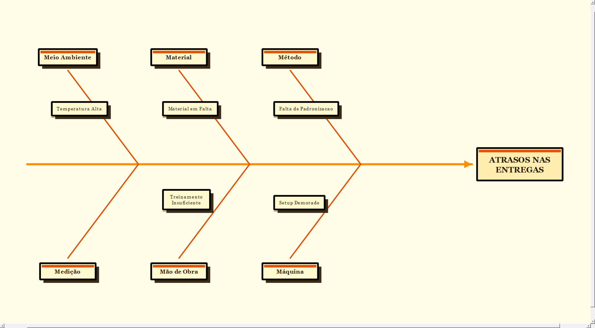

### 5W2H

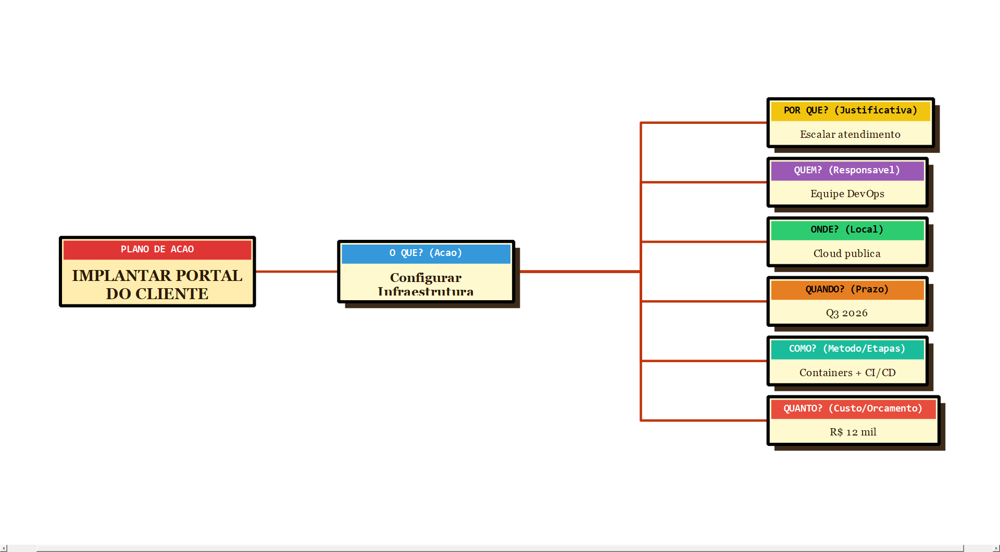

### Gantt / CPM

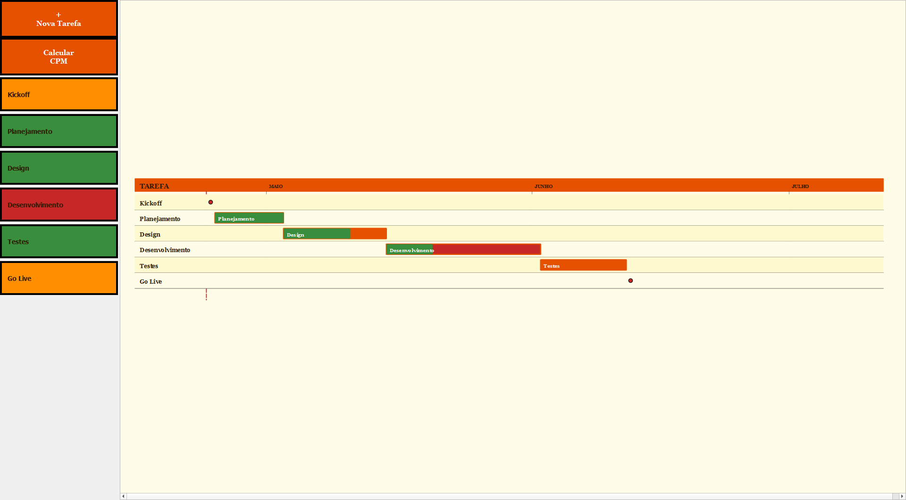

### Kanban

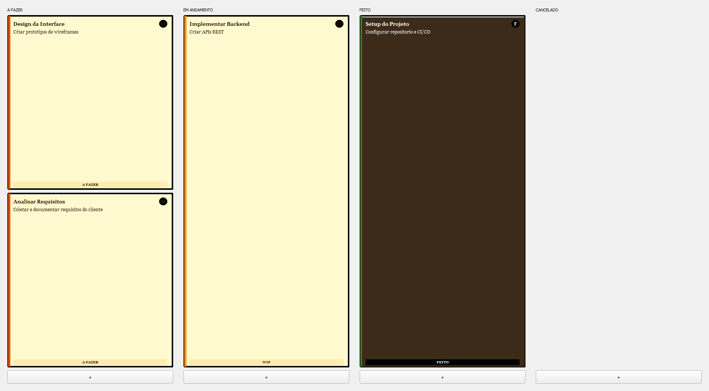

### Scrum

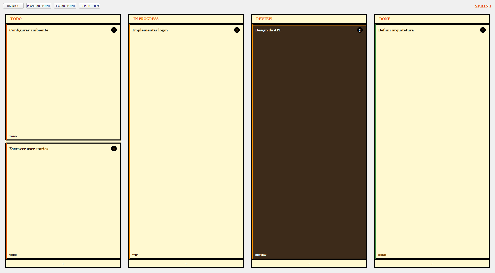

### PDCA

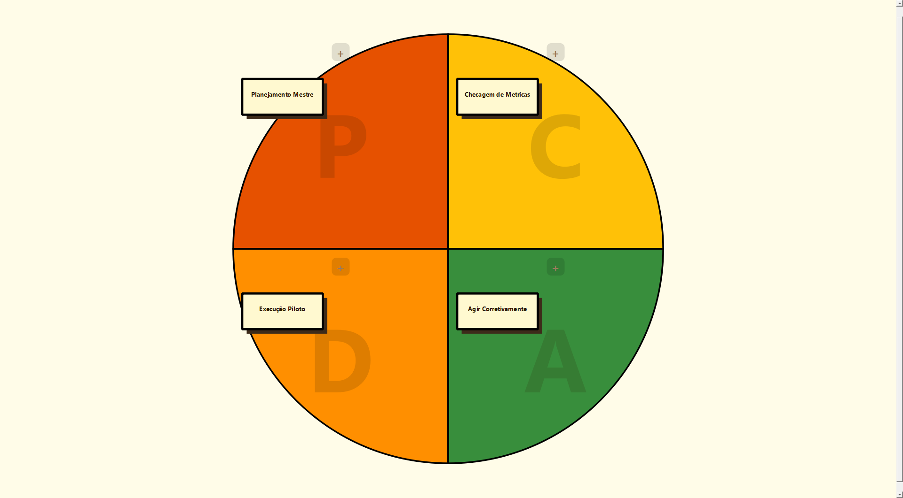

### Script Engineer

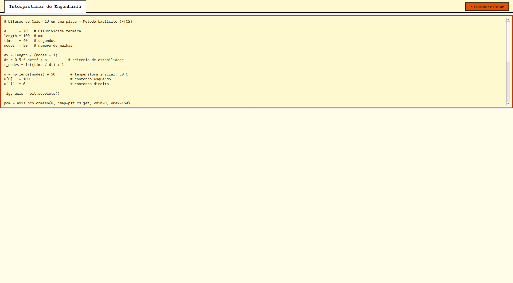

---

## 1. Flowsheet —” Diagrama de Processo (PFD)

O módulo Flowsheet permite criar diagramas de processos industriais com balanço de massa automático. É ideal paraengenheiros de processo que precisam modelar e simular plantas industriais, desde unidades simples até processos complexos com múltiplas correntes e equipamentos.

### 1.1 Interface Principal

```
┌─────────────────────────────────────────────────────────────────────────────┐
│  🔀 Flowsheet —” PFD com Balanço de Massa                 [+Equipamento] ⚙│
├─────────────────────────────────────────────────────────────────────────────┤
│                                                                             │
│    ┌──────┐         ┌──────┐         ┌──────┐         ┌──────┐            │
│    │Tanque│────────▶│Bomba │────────▶│Reator│────────▶│Torre │            │
│    │  T1  │    P1   │  B1  │    P2   │  R1  │    P3   │  C1  │            │
│    └──────┘         └──────┘         └──────┘         └──────┘            │
│      │                                             │                       │
│    [E1]                                         [P3]  [P4]               │
│  ENTRADA                               PRODUTO 1   PRODUTO 2             │
│                                                                             │
└─────────────────────────────────────────────────────────────────────────────┘
```

**Legenda da interface:**

| Elemento | Descrição |
|----------|-----------|
| Toolbar superior | Botões para adicionar equipamentos, executar balanço, exportar |
| Canvas central | Área de desenho onde os equipamentos são posicionados |
| Portas de conexão | Pontos azuis que aparecem ao passar o mouse sobre equipamentos |
| Correntes (Streams) | Setas que conectam equipamentos, representando fluidos |
| Entrada (Source) | Ponto de entrada de matéria-prima |
| Saída (Sink) | Ponto de saída de produto |

### 1.2 Adicionando Equipamentos

1. Clique no botão **"+ Equipamento"** na toolbar superior
2. Uma lista suspensa aparece com todos os tipos disponíveis
3. Selecione o equipamento desejado
4. O equipamento aparece no centro do canvas
5. Arraste para posicionar na posição desejada

#### Lista Completa de Equipamentos Disponíveis

O ProEng oferece mais de 50 símbolos de equipamentos organizados por categoria:

**Tancs e Reservatórios:**

| Ícone | Nome | Descrição |
|-------|------|-----------|
| 🛢️ | Tanque Armazenamento | Tanque atmosférico para líquidos |
| 🛢️🔻 | Tanque Pressurizado | Tanque com pressão interna |
| 🛢️↗️ | Esfera | Tanque esférico para gases liquefeitos |
| 🛢️âž¡️ | Silo | Armazenamento de sólidos granulares |
| 🛢️⬇️ | Tremonho | Reservoir com saída inferior |

**Equipamentos de Processamento:**

| Ícone | Nome | Descrição |
|-------|------|-----------|
| âš—️ | Reator CSTR | Reator de tanque agitado contínuo |
| âš—️🔄 | Reator Batelada | Reator para operações em lotes |
| âš—️âš¡ | Reator Tubular | Reator de fluxo pistonado |
| 🔥 | Forno | Aquecedor direto por combustão |
| 🌡️ | Trocador de Calor | Trocador de calor shell-and-tube |
| 🌡️⬛ | Trocador Placas | Trocador de calor de placas |
| ❄️ | Resfriador | Equipamento para redução de temperatura |
| 🔥💨 | Aquecedor | Equipamento para aumento de temperatura |

**Equipamentos de Separação:**

| Ícone | Nome | Descrição |
|-------|------|-----------|
| 🗼 | Torre Destilação | Coluna de destilação fracionada |
| 🗼🌫️ | Torre Absorção | Coluna de absorção de gases |
| 🗼💧 | Torre Extração | Coluna de extração líquido-líquido |
| 🎯 | Centrífuga | Separador centrífugo |
| 🌀 | ciclone | Separador ciclônico |
| 🕳️ | Filtro | Filtro para separação sólido-líquido |
| 🧪 | Decantador | Separador gravitacional |

**Equipamentos de Movimentação:**

| Ícone | Nome | Descrição |
|-------|------|-----------|
| 💨 | Bomba Centrífuga | Bomba para líquidos |
| 💨⬆️ | Bomba Volumétrica | Bomba de deslocamento positivo |
| 💨🔄 | Compressor | Compressor de gases |
| 💨🌀 | Ventilador | Ventilador para ar/gases |
| 🌪️ | Expansor | Expansor para recuperação de energia |

**Equipamentos de Controle:**

| Ícone | Nome | Descrição |
|-------|------|-----------|
| 🔀 | Válvula Controle | Válvula de controle de vazão |
| 🔀⬇️ | Válvula Segurança | Válvula de alívio de pressão |
| 🔀🚫 | Válvula Retenção | Válvula que permite fluxo em uma direção |
| ⛓️ | Válvula Gaveta | Válvula de isolamento |

**Equipamentos de Medição:**

| Ícone | Nome | Descrição |
|-------|------|-----------|
| 📊 | Medidor Vazão | Medidor de vazão |
| 🌡️ | Medidor Temperatura | Sensor de temperatura |
| 📏 | Medidor Pressão | Sensor de pressão |
| âš–️ | Balança | Medidor de massa |

**Outros Equipamentos:**

| Ícone | Nome | Descrição |
|-------|------|-----------|
| 🔌 | Misturador | Equipamento para mistura de correntes |
| ⬜ | Tanque Mistura | Tanque de homogeneização |
| 🔲 | Separador Multifásico | Separador de fases |
| 📦 | Alimentador | Equipamento para sólidos |

### 1.3 Criando Conexões

As conexões (streams) representam as correntes de processo que transportam matéria entre equipamentos.

#### Tutorial de Conexões Passo a Passo

1. **Passe o mouse** sobre um equipamento
2. As **portas de conexão** aparecem como pontos azuis nas extremidades
3. **Clique e segure** em uma porta de saída
4. **Arraste** até uma porta de entrada de outro equipamento
5. **Solte** o mouse para criar a conexão
6. Uma seta aparece conectando os dois equipamentos

#### Configuração Detalhada de Cada Tipo de Conexão

**Conexão de Processo (seta cheia):**
- Representa corrente de fluido no processo
- Transporta massa entre equipamentos
- Mostra composição, temperatura, pressão

**Conexão de Energia (linha tracejada):**
- Representa corrente de energia (vapor, água de resfriamento)
- Não transporta massa

**Conexão de Reciclo (seta tracejada):**
- Indica corrente de retorno ao processo

#### Dicas para Conexões

| Problema | Solução |
|----------|---------|
| Conexão não conecta | Verifique se as portas são compatíveis (entrada ↔ saída) |
| Conexão invertida | Clique com botão direito e selecione "Inverter Direção" |
| Múltiplas correntes | Use o ícone de "Conexão Múltipla" para combinar correntes |

### 1.4 Configurando Dados de Vazão

Cada conexão (stream) pode ter dados de composição e vazão configurados.

#### Editando Dados da Corrente

1. **Clique com botão direito** na conexão (seta)
2. Selecione **"Editar Dados da Corrente"**
3. Uma janela modal abre com as opções:

```
┌─────────────────────────────────────────┐
│  Editar Corrente: P1                    │
├─────────────────────────────────────────┤
│  Nome: P1                               │
│                                         │
│  Vazão Total: [1000] kg/h               │
│                                         │
│  Temperatura: [25] °C                   │
│  Pressão: [1] bar                       │
│                                         │
│  Componentes:                           │
│  ┌──────────┬─────────┬────────────┐   │
│  │Nome      │ %       │ kg/h       │   │
│  ├──────────┼─────────┼────────────┤   │
│  │Água      │ 70.0    │ 700.0      │   │
│  │NaOH     │ 20.0    │ 200.0      │   │
│  │HCl       │ 10.0    │ 100.0      │   │
│  └──────────┴─────────┴────────────┘   │
│                                         │
│  [+ Adicionar Componente]               │
│                                         │
│         [Salvar]  [Cancelar]            │
└─────────────────────────────────────────┘
```

**Campos disponíveis:**

| Campo | Descrição | Unidade |
|-------|-----------|---------|
| Nome | Identificação da corrente | Texto |
| Vazão Total | Vazão mássica total | kg/h, t/h, lb/h |
| Temperatura | Temperatura da corrente | °C, °F, K |
| Pressão | Pressão da corrente | bar, psi, atm |
| Componentes | Lista de componentes com frações | % ou fração |

#### Exemplo de Configuração Completa

```
Corrente de Alimentação - "ALIM1"
├── Vazão Total: 5000 kg/h
├── Temperatura: 25°C
├── Pressão: 2 bar
└── Componentes:
    ├── Benzeno: 40% (2000 kg/h)
    ├── Tolueno: 35% (1750 kg/h)
    ├── Xileno: 25% (1250 kg/h)
```

### 1.5 Executando Balanço de Massa

O algoritmo de Kahn calcula automaticamente as vazões em todas as correntes baseado nos dados de entrada e nas configurações de separação dos equipamentos.

#### Pré-requisitos para o Balanço

Para executar o balanço de massa com sucesso:

1. **Todas as correntes de entrada (Source)** devem ter dados definidos
2. **Equipamentos de separação** devem ter configurações de desempenho
3. **Correntes de saída (Sink)** podem ter dados parciais ou zero
4. **Sem ciclos abertos**: O sistema não resolve reciclo sem dados de convergência

#### Tutorial de Balanço de Massa Passo a Passo

**Cenário: Sistema de Neutralização**

```
     ┌──────────┐         ┌──────────┐         ┌──────────┐
     │  Source │────────▶│  Reator  │────────▶│   Sink   │
     │  Ácido  │         │          │         │  Produto │
     └──────────┘         └──────────┘         └──────────┘
           │                   │
           │              ┌────┴────┐
           │              ▼         ▼
           │         ┌────────┐ ┌────────┐
           │         │  Sink  │ │  Sink  │
           └────────▶│  Base  │ │ Residual│
                     └────────┘ └────────┘
```

**Passo 1: Configurar Entradas**

1. Adicione um **Source** (entrada de ácido)
2. Clique com botão direito → "Editar Dados da Corrente"
3. Configure:
   - Nome: "Entrada_Ácido"
   - Vazão: 1000 kg/h
   - Componentes: HCl 100%

4. Adicione outro **Source** (entrada de base)
5. Configure:
   - Nome: "Entrada_Base"
   - Vazão: 500 kg/h
   - Componentes: NaOH 100%

**Passo 2: Adicionar Equipamentos**

1. Adicione um **Reator** (tanque de neutralização)
2. Arraste as conexões das entradas para o reator

**Passo 3: Configurar Separação do Equipamento**

1. Clique com botão direito no Reator
2. Selecione "Configurar Desempenho"
3. Configure a separação:

```
┌─────────────────────────────────────────┐
│  Configurar Desempenho - Reator R1      │
├─────────────────────────────────────────┤
│                                         │
│  Porta de Saída 1 (Produto):            │
│  ├── HCl: 0% (toda reação completa)    │
│  ├── NaOH: 0% (toda reação completa)   │
│  └── H2O: 100% (produto neutro)         │
│                                         │
│  Porta de Saída 2 (Residual):            │
│  ├── HCl: 0%                            │
│  ├── NaOH: 100% (excesso de base)       │
│  └── H2O: 100%                          │
│                                         │
└─────────────────────────────────────────┘
```

**Passo 4: Executar Balanço**

1. Clique no botão **"âš™️ Balanço"** na toolbar
2. O algoritmo calcula automaticamente:
   - Vazão na saída do reator: 1500 kg/h (1000 + 500)
   - Composição do produto: água pura (reação completa)
   - Composição do residual: NaOH em excesso

**Passo 5: Verificar Resultados**

1. Clique em cada corrente para ver os valores calculados
2. As vazões e composições aparecem nas setas

#### Configuração de Split (Fração/Vazão Fixa)

Em equipamentos de separação, você pode configurar a distribuição de cada componente entre as saídas.

**Modo 1: Fração Percentual**

Configure a porcentagem de cada componente que sai em cada porta:

```
┌─────────────────────────────────────────┐
│  Componente: Benzeno                    │
│                                         │
│  Saída 1 (Destilado): [40] %            │
│  Saída 2 (Fundo):     [60] %            │
│  Total: 100% ✓                           │
└─────────────────────────────────────────┘
```

**Modo 2: Vazão Fixa**

Configure vazão constante na saída (não varia com a entrada):

```
┌─────────────────────────────────────────┐
│  Componente: Benzeno                    │
│                                         │
│  Modo: â—‹ Fração  ● Vazão Fixa           │
│                                         │
│  Saída 1 (Destilado): [200] kg/h        │
│  Saída 2 (Fundo):     [自动]            │
└─────────────────────────────────────────┘
```

**Modo 3: Razão de Split**

Defina a razão entre as saídas:

```
┌─────────────────────────────────────────┐
│  Componente: Tolueno                    │
│                                         │
│  Razão Saída1/Saída2: [1:3]             │
│  (25% saída1, 75% saída2)               │
└─────────────────────────────────────────┘
```

#### Detalhes sobre Entradas e Saídas (Source/Sink)

**Source (Entrada):**

- Representa ponto de alimentação de matéria-prima
- Define composição e vazão da corrente de entrada
- Dados são sempre fixos (entrada do sistema)
- Útil para especificar condições de operação

**Sink (Saída):**

- Representa ponto de coleta de produto ou resíduo
- Pode receber dados calculados do balanço
- Pode ter dados parciais (ex: especificar fração, calcular vazão)
- Útil para especificar requisitos de produto

### 1.6 Configurando Separação de Equipamentos

Para que o balanço funcione, equipamentos de separação devem ter suas taxas de separação configuradas.

1. Clique com **botão direito** no equipamento
2. Selecione **"Configurar Desempenho"**
3. Para cada componente, defina o comportamento:

| Tipo de Separação | Descrição | Exemplo |
|------------------|-----------|---------|
| Fração (%) | Porcentagem que sai em cada porta | 80% água sai para P1, 20% para P2 |
| Vazão Fixa | Vazão constante na saída | 100 kg/h sempre sai para P1 |
| Razão | Proporção entre saídas | 1:3 (25% P1, 75% P2) |
| Reciclo | Retorna parte da corrente para upstream | 50% retorna ao reator |

#### Exemplo: Configuração de Torre de Destilação

```
┌─────────────────────────────────────────────────────────────┐
│ Torre de Destilação - C1                                    │
├─────────────────────────────────────────────────────────────┤
│                                                             │
│ Entrada: ALIM (1000 kg/h, Benzeno 40%, Tolueno 60%)        │
│                                                             │
│ Saída 1 - Destilado (Topo):                                │
│ ├── Benzeno: 95% (380 kg/h de 400)                        │
│ └── Tolueno: 5%  (30 kg/h de 600)                          │
│                                                             │
│ Saída 2 - Fundo:                                           │
│ ├── Benzeno: 5%  (20 kg/h de 400)                          │
│ └── Tolueno: 95% (570 kg/h de 600)                         │
│                                                             │
└─────────────────────────────────────────────────────────────┘
```

### 1.7 Tips Avançados

**Criando operações em série:**
1. Conecte vários equipamentos em cascata
2. Configure cada equipamento com sua separação
3. Execute o balanço uma única vez

**Tratando correntes de reciclo:**
1. Para reciclo, use o modo "Vazão Fixa" no equipamento upstream
2. Ou especifique um valor inicial e itere

**Validação de dados:**
1. Após o balanço, verifique se todas as vazões são positivas
2. Composições devem somar 100%
3. Use "Verificar Consistência" no menu

---

## 2. BPMN —” Modelador de Processos

O módulo BPMN permite criar diagramas de processos seguindo o padrão BPMN 2.0 (Business Process Model and Notation). Ideal para mapeamento de processos, melhorias de流程, documentação e automação.

### 2.1 Conceitos Fundamentais do BPMN

BPMN é uma notação padrão para modelagem de processos de negócio. Os elementos básicos são:

| Elemento | Função | Representação |
|----------|--------|---------------|
| Pool | Contêiner principal do processo | Retângulo grande |
| Lane (Raia) | Divisão por ator/setor | faixa horizontal/vertical |
| Fluxo de Sequência | Ordem das atividades | Seta contínua |
| Fluxo de Mensagem | Comunicação entre pools | Seta tracejada |

### 2.2 Tutorial: Criando um Processo do Zero

#### Passo 1: Iniciar Novo Diagrama

1. Ao criar um novo diagrama BPMN, um **Evento de Início** padrão já aparece
2. O pool principal é criado automaticamente
3. Uma raia padrão ("Participante") também é criada

#### Passo 2: Adicionar Primeira Tarefa

1. Passe o mouse sobre o Events de Início
2. Clique no botão **"+"** que aparece à direita
3. No menu flutuante, selecione **"Tarefa"**
4. Uma nova tarefa é criada conectada ao evento de início

#### Passo 3: Encadear Atividades

1. Clique no botão **"+"** no final de cada tarefa
2. Escolha o tipo de elemento:
   - **Tarefa**: Atividade simples
   - **Gateway**: Ponto de decisão
   - **Evento**: Acontecimento

#### Passo 4: Adicionar Gateways (Decisões)

1. Clique em **"+"** após uma tarefa
2. Selecione **"Gateway Exclusivo (XOR)"**
3. Adicione tarefas após cada caminho do gateway

#### Passo 5: Criar Fluxos Alternativos

1. Clique com botão direito em uma tarefa
2. Selecione **"Adicionar Filho"**
3. Escolha **"Caminho Alternativo"**
4. Um novo gateway paralelo aparece

#### Passo 6: Concluir o Processo

1. Adicione um **Evento de Fim** ao final do último caminho
2. Conecte todas as ramificações ao fim

### 2.3 Descrição Detalhada de Cada Símbolo BPMN

#### Eventos (Events)

Eventos representam coisas que acontecem durante o processo.

**Evento de Início (Start Event):**

```
┌─────────┐
│    â—‹    │  Início do processo
└─────────┘
```

- Não tem precedência nenhuma
- Pode ser acionado por: tempo, mensagem, sinal, condição
- Representa o gatilho que inicia o processo

**Tipos de Eventos de Início:**

| Tipo | Ícone | Gatilho |
|------|-------|---------|
| Simples | â—‹ | Início básico |
| Temporizador | â—‹⏰ | Schedule (diário, semanal) |
| Mensagem | ○💬 | Recebimento de mensagem |
| Sinal | ○📡 | Recebimento de sinal |
| Condicional | â—‹âš¡ | Quando condição é verdadeira |

**Evento Intermediário (Intermediate Event):**

```
┌─────────┐
│    ◉    │  Acontecimento durante o fluxo
└─────────┘
```

- Ocorre entre início e fim
- Afeta o fluxo mas não inicia/finaliza

**Tipos de Eventos Intermediários:**

| Tipo | Ícone | Descrição |
|------|-------|-----------|
| temporizador | ◉⏰ | Espera período definido |
| Mensagem | ◉💬 | Envia/recebe mensagem |
| Sinal | ◉📡 | Envia/recebe sinal |
| Link | ◉🔗 | Conector de saltos |
| Cancelamento | ◉❌ | Cancela transação |
| Compensação | ◉↩️ | Desfaz operação |

**Evento de Fim (End Event):**

```
┌─────────┐
│    ●    │  Término do processo
└─────────┘
```

- Não tem elementos subsequentes
- Pode ter múltiplos fins em um processo

**Tipos de Eventos de Fim:**

| Tipo | Ícone | Descrição |
|------|-------|-----------|
| Simples | ● | Término normal |
| Mensagem | ●💬 | Envia mensagem ao terminar |
| Sinal | ●📡 | Emite sinal ao terminar |
| Cancelamento | ●❌ | Cancela processo |
| Compensação | ●↩️ | Executa compensação |
| Erro | ●âš ️ | Termina com erro |

#### Tarefas (Tasks)

Unidades atômicas de trabalho.

```
┌───────────────────────┐
│    [Nome da Tarefa]   │
└───────────────────────┘
```

**Tipos de Tarefas:**

| Tipo | Ícone | Descrição |
|------|-------|-----------|
| Tarefa | â–¡ | Atividade padrão |
| Envio | 📤 | Envia informação |
| Recebimento | 📥 | Aguarda informação |
| Usuário | 👤 | Realizada por pessoa |
| Script | 📜 | Executada por sistema |
| Manual | ✋ | Realizada manualmente |
| Regra | 📋 | Avaliada por rules engine |
| Serviço | âš™️ | Web service/automação |

**Subprocessos:**

| Tipo | Descrição |
|------|-----------|
| Subprocesso | Retângulo com borda dupla - processo reutilizável |
| Ad Hoc | Atividades executadas conforme necessidade |
| Transaction | Processo transacional (commit/rollback) |
| Loop | Tarefa que se repete |

#### Gateways (Decisões)

Pontos de controle que definem branching e merging do fluxo.

**Gateway Exclusivo (XOR/Exclusive):**

```
┌─────────┐
│    ✕    │  Apenas UM caminho é executado
└─────────┘
```

- Also conocido como "XOR" ou "Exclusive OR"
- **Regra**: Somente uma condição pode ser verdadeira
- **Uso típico**: Decisões binárias (sim/não, aprovado/rejeitado)

**Exemplo de configuração:**

```
Tarefa: Verificar Documentação
           │
           ▼
        ✕ XOR
       ╱     ╲
   Sim ▼     ▼ Não
      Aprovar  Rejeitar
       ╲     ╱
        └─────┘
```

**Gateway Paralelo (AND/Parallel):**

```
┌─────────┐
│    ⧉    │  TODOS os caminhos são executados
└─────────┘
```

- Também conhecido como "AND" ou "Parallel Gateway"
- **Regra**: Todos os caminhos são ativados simultaneamente
- **Uso típico**: Atividades que podem acontecer em paralelo

**Exemplo:**

```
Tarefa: Iniciar Projeto
           │
           ▼
        ⧉ AND
       ╱     ╲
   Design   Compras   ← Executam simultaneamente
    ╲     ╱
      └─────┘
        ▼
    Concluir
```

**Gateway Inclusivo (OR/Inclusive):**

```
┌─────────┐
│    â—‹    │  UM ou MAIS caminhos são executados
└─────────┘
```

- Também conhecido como "OR" ou "Inclusive OR"
- **Regra**: Qualquer combinação de condições pode ser verdadeira
- **Uso típico**: Decisões múltiplas não exclusivas

**Exemplo:**

```
Condições: [A] OU [B] OU [C]
 Pode executar: A, B, C, A+B, A+C, B+C, A+B+C
```

**Gateway Complexo (Complex):**

```
┌─────────┐
│    ✳    │  Lógica complexa de splitting/merging
└─────────┘
```

- Para condições complexas não cobertas pelos outros tipos
- Requer especificação detalhada de comportamento

### 2.4 Como Criar Loops e Fluxos Alternativos

#### Criando Loop (Repetição)

**Método 1 - Tarefa com Loop:**

1. Clique com botão direito na tarefa
2. Selecione **"Propriedades da Tarefa"**
3. Marque **"Loop"**
4. Configure:
   - **Loop Tipo**: Standard ou Multi-Instance
   - **Condição de Continuação**: Enquanto condição for verdadeira
   - **Número máximo de iterações**: Limite de segurança

**Método 2 - Loop via Gateway:**

```
[Verificar Estoque] → ✕ XOR → ┌─────────────┐
     ▲                │Sim       │Repor Estoque│
     │                └─────────────┘     │
     │                      │             │
     └──────────────────────┴─────────────┘
                    [Continuar]
```

#### Criando Fluxo Alternativo

1. Adicione um **Gateway Exclusivo** após uma tarefa
2. Adicione tarefas para cada caminho possível
3. Configure as **condições** em cada sequência:
   - Clique na seta → "Editar Condição"
   - Digite a expressão (ex: `situacao == 'pendente'`)

#### Exemplo: Processo de Aprovação com Loop

```
┌──────────────┐
│○ Início      │
└──────┬───────┘
       ▼
┌──────────────┐
│ Receber      │
│ Solicitação  │
└──────┬───────┘
       ▼
┌──────────────┐
│✕ Verificar  │
│   Dados      │
└──────┬───────┘
       ├──────────────────┐
   Dados Inválidos      Dados Válidos
       │                     │
       ▼                     ▼
┌──────────────┐      ┌──────────────┐
│ ✕ Solicitar  │      │✕ Aprovar     │
│   Correção   │      │   Gerente    │
└──────┬───────┘      └──────┬───────┘
       │                     ├───────────┐
       │                 Aprovado    Reprovado
       │                     │            │
       ▼                     ▼            ▼
       └────────────┬────────┘    ┌──────────┐
                    ▼             │ Notificar │
               [Fim]              │  Reprovado│
                                  └───────────┘
```

### 2.5 Configuração de Condições nos Gateways

#### Expressões de Condição

As condições nas setas de sequência usam linguagem de expressão:

**Operadores suportados:**

| Operador | Significado | Exemplo |
|----------|-------------|---------|
| == | Igual | status == 'aprovado' |
| != | Diferente | tipo != 'urgente' |
| > | Maior | qtde > 100 |
| < | Menor | prazo < 30 |
| >= | Maior ou igual | nota >= 7.0 |
| <= | Menor ou igual | estoque <= 10 |
| && | E | a > 5 && b < 10 |
| \|\| | Ou | tipo == 'A' \|\| tipo == 'B' |
| ! | Não | !concluido |

#### Exemplos de Configuração

**Gateway Exclusivo - Decisão de Aprovação:**

```
Sequência 1 (Aprovado):
- Condição: {aprovado == true}

Sequência 2 (Reprovado):
- Condição: {aprovado == false}
```

**Gateway Inclusivo - Múltiplas Condições:**

```
Sequência 1 (Urgente):
- Condição: {prioridade == 'urgente'}

Sequência 2 (VIP):
- Condição: {cliente.tipo == 'VIP'}

Sequência 3 (Normal):
- Condição: {prioridade == 'normal'}

Sequência 4 (Outros):
- (sem condição - rota padrão)
```

### 2.6 Boas Práticas de Modelagem BPMN

**Nomenclatura:**

- Use verbos no infinitivo: "Receber pedido", "Validar dados"
- Mantenha nomes curtos e descritivos
- Evite negativas nos nomes

**Tamanho do Processo:**

- Divida processos grandes em subprocessos
- Use participantes (lanes) para organização
- Limite a 15-20 elementos por diagrama

**Complexidade:**

- Evite mais de 3 níveis de gateways aninhados
- Use subprocessos para loops complexos
- Documente regras de negócio separadamente

---

## 3. EAP —” Estrutura Analítica do Projeto

O módulo EAP cria a hierarquia WBS (Work Breakdown Structure) do projeto, decompondo o trabalho em pacotes gerenciáveis.

### 3.1 Conceitos Fundamentais

**WBS (Work Breakdown Structure):**
- Decomposição hierárquica do trabalho total do projeto
- Cada nível inferior representa detalhe maior
- O trabalho total é 100% coberto pelos elementos folha

**Princípios Fundamentais:**
1. 100% do escopo deve estar na WBS
2. Cada elemento é único (não há duplicação)
3. Elementos folhas são "packageáveis"
4. WBS orienta cronograma, custos e riscos

### 3.2 Interface do Módulo

```
┌─────────────────────────────────────────────────────────────┐
│  📋 EAP —” Estrutura Analítica do Projeto           [Zoom +/-]│
├─────────────────────────────────────────────────────────────┤
│                                                             │
│        ┌─────────────┐                                     │
│        │  1. Projeto│  ← Nível 1 (Entrega principal)      │
│        └──────┬──────┘                                     │
│               │                                             │
│    ┌──────────┼──────────┐                                 │
│    ▼          ▼          ▼                                 │
│ ┌──────┐  ┌──────┐  ┌──────┐    ← Nível 2 (Fases)        │
│ │1.1   │  │1.2   │  │1.3   │                              │
│ │Fase A│  │Fase B│  │Fase C│                              │
│ └──────┘  └──────┘  └──────┘                              │
│    │                                             │         │
│    ▼                                             ▼         │
│ ┌──────┐  ┌──────┐                       ┌──────┐          │
│ │1.1.1 │  │1.1.2 │                       │1.3.1│ ← Nível 3│
│ │      │  │      │                       └──────┘ (Pacotes)│
│ └──────┘  └──────┘                                            │
│                                                             │
└─────────────────────────────────────────────────────────────┘
```

### 3.3 Criando a Estrutura

1. O nó raiz (1) é criado automaticamente com o nome do projeto
2. **Passe o mouse** sobre um nó para revelar os botões de ação:
   - **(+)** inferior: Adicionar nó filho
   - **(→)** lateral: Adicionar nó irmão (same nível)
   - **(-)**: Excluir nó
3. Clique no botão desejado para criar o nó

### 3.4 Exemplo Prático: WBS de Projeto Real

**Cenário: Projeto de Construção de uma Planta Industrial**

```
                    ┌─────────────────────┐
                    │ 1. Projeto Fabrica  │
                    │    de Processamento  │
                    └──────────┬────────────┘
                               │
         ┌─────────────────────┼─────────────────────┐
         ▼                     ▼                     ▼
    ┌─────────┐          ┌─────────┐          ┌─────────┐
    │1.1      │          │1.2      │          │1.3      │
    │Planejam.│          │Engenharia│          │Construção│
    └────┬────┘          └────┬────┘          └────┬────┘
         │                    │                    │
    ┌────┴────┐         ┌────┴────┐         ┌────┴────┐
    ▼         ▼         ▼         ▼         ▼         ▼
 ┌──────┐ ┌──────┐  ┌──────┐ ┌──────┐  ┌──────┐ ┌──────┐
 │1.1.1 │ │1.1.2 │  │1.2.1 │ │1.2.2 │  │1.3.1 │ │1.3.2 │
 │Escopo│ │Crono │  │Basic │ │Detail│  │CIVIL │ │Mec.  │
 └──────┘ └──────┘  └──────┘ └──────┘  └──────┘ └──────┘
    │         │         │         │         │         │
    ▼         ▼         ▼         ▼         ▼         ▼
 ┌──────┐ ┌──────┐  ┌──────┐ ┌──────┐  ┌──────┐ ┌──────┐
 │1.1.1.│ │1.1.2.│  │1.2.1.│ │1.2.2.│  │1.3.1.│ │1.3.2.│
 │1 Def.│ │1 Def.│  │1 P&ID│ │1 Proc│  │1 Fund│ │1 Inst│
 │Escopo│ │Marco │  │      │ │Cálc. │  │ação  │ │Equip.│
 └──────┘ └──────┘  └──────┘ └──────┘  └──────┘ └──────┘
```

**Detalhamento completo:**

```
1. Projeto Fabrica de Processamento
│
├── 1.1 Planejamento
│   ├── 1.1.1 Definição de Escopo
│   │   ├── 1.1.1.1 Escopo do produto
│   │   ├── 1.1.1.2 Escopo do projeto
│   │   └── 1.1.1.3 EAP do projeto
│   ├── 1.1.2 Cronograma
│   │   ├── 1.1.2.1 Cronograma macro
│   │   ├── 1.1.2.2 Cronograma detalhado
│   │   └── 1.1.2.3 Cronograma de aquisição
│   ├── 1.1.3 Orçamento
│   │   ├── 1.1.3.1 Orçamento macro
│   │   └── 1.1.3.2 Orçamento detalhado
│   └── 1.1.4 Riscos
│       ├── 1.1.4.1 Registro de riscos
│       └── 1.1.4.2 Plano de mitigação
│
├── 1.2 Engenharia
│   ├── 1.2.1 Engenharia Básica
│   │   ├── 1.2.1.1 P&ID
│   │   ├── 1.2.1.2 Layout de planta
│   │   ├── 1.2.1.3 специÑ„икация de equipamentos
│   │   └── 1.2.1.4 специificação de tubulação
│   ├── 1.2.2 Engenharia de Detalhamento
│   │   ├── 1.2.2.1 Projetos mecânicos
│   │   ├── 1.2.2.2 Projetos civis
│   │   ├── 1.2.2.3 Projetos elétricos
│   │   └── 1.2.2.4 Projetos de controle
│   └── 1.2.3 Documentação
│       ├── 1.2.3.1 Manuais de operação
│       └── 1.2.3.2 As-built
│
├── 1.3 Construção
│   ├── 1.3.1 Civil
│   │   ├── 1.3.1.1 Fundação
│   │   ├── 1.3.1.2 Estrutura
│   │   ├── 1.3.1.3 Edificações
│   │   └── 1.3.1.4 Instalações utilities
│   ├── 1.3.2 Mecânica
│   │   ├── 1.3.2.1 Instalação de equipamentos
│   │   ├── 1.3.2.2 Instalação de tubulação
│   │   ├── 1.3.2.3 Isolamento térmico
│   │   └── 1.3.2.4 Pintura industrial
│   ├── 1.3.3 Elétrica
│   │   ├── 1.3.3.1 Rede de distribuição
│   │   ├── 1.3.3.2 Iluminação
│   │   └── 1.3.3.3 Aterramento
│   └── 1.3.4 Instrumentação
│       ├── 1.3.4.1 Instalação de instrumentos
│       └── 1.3.4.2 Programação de CLP
│
├── 1.4 Comissionamento
│   ├── 1.4.1 Testes Unitários
│   ├── 1.4.2 Testes Integrados
│   └── 1.4.3 Start-up
│
└── 1.5 Entrega
    ├── 1.5.1 Treinamento
    ├── 1.5.2 Documentação final
    └── 1.5.3 Acceptação
```

### 3.5 Formatos de Nós

Ao adicionar um nó, você pode escolher o formato:

| Formato | Símbolo | Uso |
|---------|---------|-----|
| Retângulo Arredondado | ╭──────╮ | Pacote de trabalho normal |
| Elipse | ◯ | Marco (milestone) - entregazero duração |
| Losango | ◇ | Decisão - ponto de verificação |
| Retângulo Pontilhado | â”…â”…â”…â”…â”… | Trabalho externo (outsourced) |

### 3.6 Numeração WBS

O código WBS é gerado automaticamente conforme o nível:

```
Nível 1:     1              (Projeto)
Nível 2:     1.1, 1.2, ... (Fases/Deliverables)
Nível 3:     1.1.1, 1.1.2  (Pacotes de trabalho)
Nível 4:     1.1.1.1       (Tarefas)
```

### 3.7 Como Exportar para Excel

O ProEng permite exportar a estrutura WBS para Excel (`.xlsx`) para manipulação adicional.

**Passo 1: Exportar do ProEng**

1. No módulo EAP, localize o botão **"Exportar"** na toolbar
2. Selecione a opção **"Exportar para Excel"**
3. Escolha o local e nome do arquivo
4. O arquivo `.xlsx` é gerado

**Passo 2: Estrutura do Excel Gerado**

O Excel terá colunas:
- Código WBS
- Nome do Elemento
- Tipo (Pacote/Marco/Decisão)
- Responsável
- Duração Estimada

| Código | Nome | Tipo | Responsável | Duração |
|--------|------|------|-------------|---------|
| 1 | Projeto Fabrica | Pacote | PM | 24 meses |
| 1.1 | Planejamento | Pacote | PM | 2 meses |
| 1.1.1 | Definição de Escopo | Pacote | Analista | 1 semana |
| 1.1.2 | Cronograma | Pacote | Planejador | 2 semanas |
| 1.1.3 | Orçamento | Pacote | Controller | 2 semanas |

### 3.8 Dicas de Estruturação

**Regra 100%:**
- Certifique-se que todos os entregáveis estão cobertos
- Não deixe trabalho "órfão" (não atribuído a nenhum nó)

**Tamanho ideal:**
- Elementos folhas devem ser estimáveis (40-80 horas)
- Evite nós com mais de 8-10 filhos

**Nomenclatura:**
- Use nomes动词 + objeto
- Ex: "Desenvolver especificação", "Construir fundação"
- Mantenha consistência de linguagem

---

## 4. PM Canvas —” Project Model Canvas

O PM Canvas é baseado no conceito de Canvas de Projetos, organizando 15 blocos em uma visão integrada do projeto.

### 4.1 Estrutura do Canvas

```
┌───────────┬───────────┬───────────┬───────────┬───────────┐
│ JUSTIFIC. │   OBJ     │  BENEF.   │  PRODUTO  │   RISCOS  │
│           │  SMART    │           │           │           │
├───────────┼───────────┼───────────┼───────────┼───────────┤
│           │           │           │           │           │
│  REQ      │  STAKEH   │  EQUIPE   │   PREM    │    TMP    │
│           │  HOLDERS │           │           │           │
├───────────┴───────────┴───────────┴───────────┴───────────┤
│                         │ CUSTOS      │                    │
└─────────────────────────┴─────────────┴────────────────────┘
```

### 4.2 Detalhamento dos 15 Blocos

#### Bloco 1: Justificativa (Grupo Superior Esquerdo)

**Objetivo:** Explicar por que o projeto existe e qual problemaresolve.

**Pergunta-chave:** Por que fazer este projeto?

**Exemplo de Preenchimento:**

```
JUSTIFICATIVA
═══════════════
A empresa enfrenta gargalos na produção que 
resultam em atrasos de entrega de 30% dos 
pedidos. O projeto de expansão da capacidade
produtiva resolverá o problema, permitindo 
atender a demanda crescente e recuperar 
market share perdido para concorrentes.
```

---

#### Bloco 2: Objetivos SMART

**Objetivo:** Definir o que será alcançado de forma mensurável.

**Requisitos SMART:**
- **S**pecific (Específico): O que exatamente será feito?
- **M**easurable (Mensurável): Como mediremos o sucesso?
- **A**chievable (Alcançável): É possível atingir?
- **R**elevant (Relevante): Alinha-se com estratégia?
- **T**ime-bound (Temporal): Qual o prazo?

**Exemplo de Preenchimento:**

```
OBJETIVOS
═══════════
Aumentar a capacidade produtiva da planta 
de 50.000 para 80.000 unidades/mês até 
dezembro/2025, com investimento máximo 
de R$ 5 milhões, mantendo indicadores de 
qualidade superiores a 98%.
```

---

#### Bloco 3: Benefícios

**Objetivo:** Listar os benefícios esperados do projeto.

**Pergunta-chave:** O que ganha a organização?

**Exemplo de Preenchimento:**

```
BENEFÍCIOS
═══════════
• Aumento de 60% na capacidade produtiva
• Redução de 25% nos custos unitários
• Prazo de entrega reduzido em 40%
• Aumento da satisfação do cliente (NPS +15)
• Geração de 20 novos empregos
```

---

#### Bloco 4: Produto (Entregável)

**Objetivo:** Definir exatamente o que será entregue.

**Pergunta-chave:** O que será produzido/entregue?

**Exemplo de Preenchimento:**

```
PRODUTO / ENTREGÁVEL
═══════════════════════
• Nova linha de produção completa
• Equipamentos instalados e testados
• Documentação técnica as-built
• Procedimentos operacionais
• Equipe treinada (20 operadores)
• Licenças e alvarás obtidos
```

---

#### Bloco 5: Riscos

**Objetivo:** Identificar principais riscos do projeto.

**Estrutura padrão:**
- Risco | Probabilidade | Impacto | Ação de Mitigação

**Exemplo de Preenchimento:**

```
RISCOS PRINCIPAIS
═══════════════════
| Risco | P | I | Mitigação |
|-------|---|---|------------|
| Atraso entrega equipamentos | A | A | Compra com antecedência + multa |
| Aumento custo matéria-prima | M | M | Contrato de hedge |
| Aprovação ambiental | M | A | Contratar consultoria especializada |
| Turnover equipe ключ | B | M | Bonificação por permanência |
```

---

#### Bloco 6: Requisitos

**Objetivo:** Capturar necessidades e restrições do projeto.

**Categorias:**
- Funcionais (o que o sistema deve fazer)
- Não-funcionais (qualidade, performance)
- Legais/regulatórios
- De_INTERFACE

**Exemplo de Preenchimento:**

```
REQUISITOS
═══════════
FUNCIONAIS:
- Processar 80.000 unidades/mês
- Sistema ERP integrado
- Relatórios em tempo real

NÃO-FUNCIONAIS:
- Disponibilidade 99.5%
- Tempo de resposta < 2s

REGULATÓRIOS:
- Licença ambiental
- NR-12 (segurança máquina)
```

---

#### Bloco 7: Stakeholders

**Objetivo:** Identificar todas as partes interessadas.

**Categorias:**
- Internos: Sponsor, PM, equipe, áreas impactadas
- Externos: Clientes, fornecedores, reguladores

**Exemplo de Preenchimento:**

```
STAKEHOLDERS
═══════════════
INTERNO:
✓ Sponsor: Diretor Industrial
✓ PM: João Silva
✓ Equipe: 10 pessoas
✓ Área afetada: Produção, Qualidade

EXTERNO:
✓ Cliente: Não afetado diretamente
✓ Fornecedor: Atlas Equipamentos
✓ Regulador: IBAMA, CREA
```

---

#### Bloco 8: Equipe

**Objetivo:** Definir a equipe do projeto e papéis.

**Estrutura:**
- Papéis-chave
- Quantidade de pessoas
- Habilidades necessárias

**Exemplo de Preenchimento:**

```
EQUIPE DO PROJETO
═══════════════════
Papel            │ Qtd │ Perfil
─────────────────┼─────┼────────────────
Gerente Projeto  │  1  │ PMP, experiência
Eng. Mecânica    │  2  │ Sênior
Eng. Elétrica    │  1  │ Sênior
Coordenador      │  1  │ Construção
Técnicos         │  6  │ Instalação
Admin            │  1  │ Suporte
```

---

#### Bloco 9: Premissas

**Objetivo:** Declarar condições aceitas como verdadeiras.

**Pergunta-chave:** O que estamos assumindo como verdade?

**Exemplo de Preenchimento:**

```
PREMISSAS
═══════════
• Orçamento aprovado até 15/03/2025
• Fornecedor disponível para entrega em 60 dias
• Area de construção liberada até 01/04/2025
• Mão de obra姑 disponível na região
• Clima favorável durante obra (sem chuva excessiva)
```

---

#### Bloco 10: Timeline (Cronograma)

**Objetivo:** Mostrar o schedule geral do projeto.

**Exemplo de Preenchimento:**

```
TIMELINE
═══════════════════
Jan  │►►►►►►►►►│  Planejamento
Fev  │    ►►►►►│  Engenharia
Mar  │       ►│  Licitações
Abr  │►►►►►►►►│  Construção Civil
May  │  ►►►►►►│  Inst. Equipamentos
Jun  │   ►►►►►│  Comissionamento
Jul  │    ►►►►│  Start-up
Ago  │     ►✓  │  Entrega
```

---

#### Bloco 11: Restrições

**Objetivo:** Listar limitações do projeto.

**Pergunta-chave:** O que limita o projeto?

**Exemplo de Preenchimento:**

```
RESTRIÇÕES
═══════════════
• Orçamento máximo: R$ 5.000.000
• Prazo máximo: 8 meses
• Area disponível: 500 m²
• Capacidade elétrica: 500 kVA
• Legislação: NR-12, NR-10,环保
```

---

#### Bloco 12: Custos

**Objetivo:** Resumir o orçamento do projeto.

**Categorias:**
- Equipamentos
- Mão de obra
- Materiais
- Contingência

**Exemplo de Preenchimento:**

```
CUSTOS
═══════════════════
ITEM                      │ VALOR (R$)
──────────────────────────┼─────────────
Equipamentos              │ 2.500.000
Mão de Obra               │ 1.200.000
Materiais                 │ 800.000
Projeto/Eng.              │ 300.000
Contingência (15%)        │ 200.000
──────────────────────────┼─────────────
TOTAL                     │ 5.000.000
```

### 4.3 Adicionando Anotações a Blocos

Cada bloco pode ter múltiplas anotações:

1. Passe o mouse sobre uma seção
2. Clique no botão **(+)** que aparece no centro
3. Um novo bloco amarelo é criado dentro da seção
4. Duplo clique para editar o conteúdo

### 4.4 Excluindo Anotações

1. Passe o mouse sobre um bloco
2. Clique no botão **(-)** no canto superior direito

---

## 5. Ishikawa —” Diagrama de Causa e Efeito

O diagrama de Ishikawa (também chamado de diagrama de espinha de peixe ou diagrama de causa e efeito) é usado para análise de causa raiz de problemas.

### 5.1 Metodologia 6M Explicada

As 6 categorias M são um framework para分类 causas de problemas:

| Categoria | Significado | Descrição |
|-----------|-------------|-----------|
| **M**étodo | Processo | Como o trabalho é realizado |
| **M**áquina | Equipamentos | Máquinas, ferramentas, tecnologia |
| **M**aterial | Insumos | Matérias-primas, componentes |
| **M**ão de Obra | Pessoas | Treinamento, capacidade, motivação |
| **M**eio Ambiente | Contexto | Local, condições, ambiente |
| **M**edição | Dados | Sistemas de medição, coleta de dados |

### 5.2 Estrutura do Diagrama

```
         Método
            │
     ┌──────┼──────┐
     │      │      │
  Máq  Material  Mão de Obra
     │      │      │
     └──────┼──────┘
            │
     ┌──────┼──────┐
     │      │      │
  Meio   Medição   │
     │      │      │
     └──────┼──────┘
            │
         [EFEITO]
```

### 5.3 Como Usar para Análise de Causa Raiz

#### Passo 1: Definir o Problema (Efeito)

1. **Duplo clique** no retângulo "EFEITO / PROBLEMA"
2. Digite o problema específico a ser analisado
3. Sea preciso, use dados quantitativos: "Taxa de rejeição de 15%"

#### Passo 2: Identificar Categorias

1. O diagrama já vem com as 6 categorias 6M
2. Para cada categoria, pense: "Que causas nesta categoria contribuem para o problema?"

#### Passo 3: Brainstorming de Causas

1. Passe o mouse sobre uma categoria
2. Clique no botão **(+)** para adicionar sub-causas
3. Digite a causa identificada
4. Repita para todas as causas encontradas

#### Passo 4: Hierarquizar Causas

- **Nível 0**: Cabeça (Efeito/Problema)
- **Nível 1**: Categorias 6M
- **Nível 2**: Causas primárias
- **Nível 3**: Sub-causas (causas raiz)

### 5.4 Exemplos de Causas por Categoria

**Problema示例: "Produção com Taxa de Defeitos de 10%"**

| Categoria | Causas Identificadas |
|-----------|---------------------|
| **Método** | • Procedimento não atualizado<br>• Sequência de operações incorreta<br>• Falta de padronização |
| **Máquina** | • Máquina com manutenção preventiva atrasada<br>• Desgaste de ferramentas<br>• Calibração imprecisa |
| **Material** | • Fornecedor com qualidade variável<br>• Armazenamento inadequado<br>• Especificação do material incorreta |
| **Mão de Obra** | • Treinamento incompleto<br>• Rotatividade alta<br>• Falta de atenção |
| **Meio Ambiente** | • Temperatura fora da faixa<br>• Umidade elevada<br>• Iluminação inadequada |
| **Medição** | • Instrumento descalibrado<br>• Amostragem insuficiente<br>• Erro de registro |

### 5.5 Exemplo Completo de Ishikawa

```
EFEITO: Taxa de Retorno de Clientes de 8%

═══════════════════════════════════════════════════════════════

MÉTODO
├── Processo de venda agressivo
├── Pós-venda inadequado
├── Política de devolução flexível demais
│
MÁQUINA
├── Sistema de CRM instável
├── Falhas no database de clientes
│
MATERIAL
├── Produto com qualidade inconsistente
├── Embalagem danificada no transporte
│
MÃO DE OBRA
├── Equipe de vendas sem treinamento
├── Atendimento ao cliente descortês
├── Falta de autonomia para resolver problemas
│
MEIO AMBIENTE
├── Concorrência com promoções agressivas
├── Mercado em recessão
│
MEDIÇÃO
├── NPS calculado incorretamente
├── Pesquisa de satisfação mal estruturada
└── Feedback não chega à operação
```

---

## 6. 5W2H —” Plano de Ação

O módulo 5W2H cria planos de ação estruturados utilizando a metodologia 5W2H.

### 6.1 Quando Usar Esta Ferramenta

O 5W2H é ideal para:

| Situação | Uso |
|----------|-----|
| **Planos de Ação** | Definir ações detalhadas de projetos |
| **Resolução de Problemas** | Definir ações corretivas após análise |
| **Projetos** | Detalhar atividades de implementação |
| **Ações de Melhoria** | Documentar iniciativas de melhoria |
| **Auditorias** | Registrar ações de correção |

### 6.2 Estrutura 5W2H

```
┌─────────────────┐
│ PLANO DE AÇÃO   │  ← ROOT
└────────┬────────┘
         │
    ┌────┴────┐
    ▼         ▼
┌────────┐ ┌────────┐
│ O QUÊ? │ │ O QUÊ? │   ← WHAT (Ação)
└───┬────┘ └───┬────┘
    │         │
 ┌──┼──┐  ┌──┼──┐
 │  │  │  │  │  │
 ▼  ▼  ▼  ▼  ▼  ▼
WHY WHO WHEN WHERE HOW COST
```

**Significado de cada elemento:**

| Sigla | Significado | Pergunta |
|-------|-------------|----------|
| **W**hat (O quê?) | Ação a ser realizada | O que será feito? |
| **W**hy (Por quê?) | Justificativa | Por que fazer? |
| **W**ho (Quem?) | Responsável | Quem vai fazer? |
| **W**here (Onde?) | Local | Onde será feito? |
| **W**hen (Quando?) | Prazo | Quando será feito? |
| **H**ow (Como?) | Método | Como será feito? |
| **H**ow much (Quanto?) | Custo | Quanto custa? |

### 6.3 Exemplo Prático Completo

**Problema identificado:** "Máquina de embalagem com taxa de paradas de 30%"

**Plano de Ação 5W2H:**

```
═══════════════════════════════════════════════════════════════
AÇÃO 1: Realizar manutenção preventiva na máquina
═══════════════════════════════════════════════════════════════

O QUE?     │ Realizar revisão completa e troca de peças gastas
POR QUÊ?   │ Reduzir falhas e paradas não programadas
QUEM?      │ Equipe de manutenção (José, Carlos)
ONDE?      │ Área de produção - Máquina Embaladora 3
QUANDO?    │ 15/03/2025 (parada programada)
COMO?      │ 1. Verificar histórico de falhas
           │ 2. Inspecionar componentes críticos
           │ 3. Substituir peças com vida útil vencida
           │ 4. Testar funcionamento
CUSTO      │ R$ 5.000 (peças) + R$ 2.000 (mão de obra)

═══════════════════════════════════════════════════════════════
AÇÃO 2: Treinar operadores sobre operação correta
═══════════════════════════════════════════════════════════════

O QUE?     │ Treinamento teórico e prático de operação
POR QUÊ?   │ Reduzir erros de operação que causam paradas
QUEM?      │ Supervisor de produção (Marcos) + Operadores
ONDE?      │ Sala de treinamento + Linha de produção
QUANDO?    │ 20/03/2025
COMO?      │ 1. Preparar material didático
           │ 2. Executar treinamento (4 horas)
           │ 3. Aplicar avaliação
           │ 4. Emitir certificado
CUSTO      │ R$ 1.500 (material) + R$ 800 (hora extra)

═══════════════════════════════════════════════════════════════
AÇÃO 3: Implementar monitoramento de condições
═══════════════════════════════════════════════════════════════

O QUE?     │ Instalar sensores de vibração e temperatura
POR QUÊ?   │ Detectar anomalias antes da falha
QUEM?      │ Engenharia de manutenção
ONDE?      │ Máquina Embaladora 3 - pontos críticos
QUANDO?    │ 01/04/2025
COMO?      │ 1. Mapear pontos de monitoramento
           │ 2. Instalar sensores IoT
           │ 3. Configurar alertas no sistema
           │ 4. Definir thresholds de alarme
CUSTO      │ R$ 12.000 (equipamentos) + R$ 3.000 (instalação)
```

### 6.4 Adicionando Novas Ações

1. Clique no botão **(+)** vermelho no nó raiz
2. Uma nova ação é criada com todos os campos 5W2H vazios
3. Preencha cada campo com duplo clique

### 6.5 Preenchendo os Campos

1. **Duplo clique** em qualquer caixa colorida
2. Digite o conteúdo sesuai campo
3. Pressione **Enter** para confirmar

### 6.6 Excluindo Ação

1. Passe o mouse sobre uma ação WHAT
2. Clique no botão **(-)** vermelho

---

## 7. Gantt —” Cronograma com Caminho Crítico

O módulo Gantt permite criar e gerenciar cronogramas de projeto com cálculo automático do caminho crítico (CPM).

### 7.1 Conceitos Fundamentais

O **gráfico de Gantt** exibe as tarefas do projeto como barras horizontais ao longo de uma linha do tempo, permitindo visualizar durações, dependências e o progresso de cada atividade.

**Elementos do Cronograma:**

| Elemento | Descrição |
|----------|-----------|
| Tarefa | Atividade com nome, data início, data fim e progresso |
| Marco (Milestone) | Ponto de referência (duração zero) representado como círculo |
| Predecessora | Tarefa que deve ser concluída antes da atual |
| Caminho Crítico | Sequência de tarefas sem folga que define a duração total |

### 7.2 Interface do Módulo

```
┌─────────────────────────────────────────────────────────────────┐
│  CRONOGRAMA GANTT                    [Nova Tarefa] [Calcular CPM]│
├─────────────┬───────────────────────────────────────────────────┤
│  TAREFAS    │          LINHA DO TEMPO                          │
│             │  Jan   Feb   Mar   Apr   May   Jun               │
│ Tarefa 1    │  ████████████░░░░                                │
│ Tarefa 2    │        ██████████████                            │
│ Tarefa 3    │                    ██████████                    │
│ Marco       │                          ●                       │
│             │              │← HOJE                             │
└─────────────┴───────────────────────────────────────────────────┘
```

### 7.3 Tutorial: Criando um Cronograma

#### Passo 1: Adicionar Tarefas

1. Clique em **"Nova Tarefa"** no painel esquerdo
2. Preencha: nome, data de início, data de término e progresso (%)
3. A tarefa aparece como barra horizontal no gráfico

#### Passo 2: Definir Dependências

1. Clique sobre uma tarefa na lista para editá-la
2. No campo **"Predecessora"**, selecione a tarefa que deve ser concluída antes
3. As dependências influenciam o cálculo do caminho crítico

#### Passo 3: Criar Marcos (Milestones)

1. Ao criar/editar uma tarefa, marque a opção **"Marco (Milestone)"**
2. Marcos são exibidos como círculos na timeline

#### Passo 4: Calcular Caminho Crítico

1. Clique em **"Calcular CPM"**
2. Tarefas críticas (sem folga) são destacadas em vermelho
3. Estas tarefas determinam a duração total do projeto

### 7.4 Dicas de Uso

| Situação | Recomendação |
|----------|--------------|
| Projeto com muitas tarefas | Agrupe em fases usando o EAP antes |
| Tarefas paralelas | Sem predecessora, elas se sobrepõem na timeline |
| Atraso no cronograma | Verifique tarefas do caminho crítico primeiro |
| Visualização | Use Ctrl + Scroll para zoom na timeline |

---

## 8. Kanban —” Quadro de Gestão Visual

O módulo Kanban implementa um quadro visual para gestão de tarefas com 4 colunas de status e cards arrastáveis.

### 8.1 Conceitos Fundamentais

O **Kanban** é um sistema puxado de gestão que limita o trabalho em progresso (WIP) e foca na conclusão de tarefas antes de iniciar novas.

**Princípios:**

1. **Visualize o trabalho**: Cada tarefa é um card visual
2. **Limite o WIP**: Mantenha poucas tarefas em andamento
3. **Gerencie o fluxo**: Mova cards da esquerda para a direita
4. **Melhore continuamente**: Analise gargalos no quadro

### 8.2 Interface do Módulo

```
┌──────────────┬──────────────┬──────────────┬──────────────┐
│  A FAZER     │ EM ANDAMENTO │    FEITO     │  CANCELADO   │
├──────────────┤──────────────┤──────────────┤──────────────┤
│ ┌──────────┐ │ ┌──────────┐ │ ┌──────────┐ │              │
│ │ Card 1   │ │ │ Card 3   │ │ │ Card 5   │ │              │
│ │ ALTA     │ │ │ MEDIA    │ │ │ BAIXA    │ │              │
│ └──────────┘ │ └──────────┘ │ └──────────┘ │              │
│ ┌──────────┐ │              │              │              │
│ │ Card 2   │ │              │              │              │
│ │ MEDIA    │ │              │              │              │
│ └──────────┘ │              │              │              │
│    [+]       │    [+]       │    [+]       │    [+]       │
└──────────────┴──────────────┴──────────────┴──────────────┘
```

### 8.3 Tutorial: Usando o Kanban

#### Adicionando Cards

1. Clique no botão **(+)** na parte inferior de cada coluna
2. Preencha título, descrição e prioridade (ALTA / MÉDIA / BAIXA)
3. O card aparece na coluna selecionada

#### Editando Cards

1. Clique em um card para abrir o editor
2. Modifique título, descrição ou prioridade
3. Confirme as alterações

#### Movendo Cards (Drag-and-Drop)

1. Clique e segure em um card
2. Arraste até a coluna de destino
3. Solte para atualizar o status

#### Excluindo Cards

1. Clique com **botão direito** sobre o card
2. Selecione **"Deletar"** no menu de contexto

### 8.4 Prioridades

| Prioridade | Visual | Recomendação |
|------------|--------|--------------|
| **ALTA** | Cor quente (destaque forte) | Tarefas urgentes, resolver primeiro |
| **MÉDIA** | Cor neutra (destaque padrão) | Tarefas normais, fluxo regular |
| **BAIXA** | Cor fria (destaque sutil) | Tarefas que podem aguardar |

---

## 9. Scrum —” Sprint Board

O módulo Scrum implementa o framework ágil com gestão de backlog, sprints e story points.

### 9.1 Conceitos Fundamentais

O **Scrum** é um framework ágil para gestão de projetos iterativos, organizado em ciclos (Sprints) de duração fixa.

**Papéis e Artefatos:**

| Conceito | Descrição |
|----------|-----------|
| Backlog | Lista priorizada de todas as user stories do produto |
| Sprint | Ciclo de trabalho fixo (1-4 semanas) |
| Story Points | Estimativa de esforço relativa (escala Fibonacci) |
| Sprint Board | Quadro visual do progresso da Sprint atual |

### 9.2 Interface do Módulo

```
┌─────────────────────────────────────────────────────────────────┐
│ [BACKLOG] [PLANEJAR SPRINT] [FECHAR SPRINT] [+ SPRINT ITEM]    │
│                                        Sprint 1 —” 15pts        │
├───────────────┬───────────────┬───────────────┬─────────────────┤
│    TODO       │  IN PROGRESS  │    REVIEW     │     DONE        │
├───────────────┤───────────────┤───────────────┤─────────────────┤
│ ┌───────────┐ │ ┌───────────┐ │ ┌───────────┐ │ ┌───────────┐  │
│ │ Story 1 3 │ │ │ Story 3 5 │ │ │ Story 5 3 │ │ │ Story 7 2 │  │
│ │ TODO      │ │ │ WIP       │ │ │ REVIEW    │ │ │ DONE      │  │
│ └───────────┘ │ └───────────┘ │ └───────────┘ │ └───────────┘  │
│    [+]        │    [+]        │    [+]        │    [+]         │
└───────────────┴───────────────┴───────────────┴─────────────────┘
```

### 9.3 Tutorial: Fluxo Completo de Sprint

#### Passo 1: Criar Backlog

1. Clique em **"BACKLOG"** para ver itens pendentes
2. Use **"+ SPRINT ITEM"** para criar novas user stories
3. Defina título, descrição e story points

#### Passo 2: Planejar Sprint

1. Clique em **"PLANEJAR SPRINT"**
2. Selecione itens do Backlog para mover ao Sprint (coluna TODO)
3. Monitore o total de story points no cabeçalho

#### Passo 3: Executar Sprint

1. Arraste cards de **TODO** para **IN PROGRESS** ao iniciar trabalho
2. Move para **REVIEW** quando estiver pronto para revisão
3. Arraste para **DONE** quando concluído

#### Passo 4: Fechar Sprint

1. Clique em **"FECHAR SPRINT"**
2. O sistema exibe métricas:
   - Quantidade de itens concluídos
   - Total de story points entregues
   - Itens não concluídos (carryover)

### 9.4 Story Points —” Escala Fibonacci

| Pontos | Significado |
|--------|-------------|
| 1 | Tarefa trivial (minutos) |
| 2 | Tarefa simples (poucas horas) |
| 3 | Tarefa pequena (meio dia) |
| 5 | Tarefa média (1 dia) |
| 8 | Tarefa grande (2-3 dias) |
| 13 | Tarefa muito grande (1 semana) |
| 21 | Épico (deve ser decomposto) |

---

## 10. PDCA —” Ciclo de Melhoria Contínua

O módulo PDCA implementa o ciclo de Deming em um layout circular dividido em 4 quadrantes temáticos.

### 10.1 Conceitos Fundamentais

O **PDCA** (Plan-Do-Check-Act) é um método iterativo de melhoria contínua utilizado para resolver problemas e otimizar processos. O ciclo se repete indefinidamente, promovendo aprimoramento progressivo.

**Os 4 Passos:**

| Fase | Significado | Pergunta-chave |
|------|-------------|----------------|
| **P** (Plan) | Planejar | O que vamos melhorar e como? |
| **D** (Do) | Executar | Implementar ações em escala piloto |
| **C** (Check) | Verificar | Os resultados atingiram as metas? |
| **A** (Act) | Agir | Padronizar ou corrigir e reiniciar |

### 10.2 Interface do Módulo

```
                    ┌───────────┐
               ╱    │           │    ╲
             ╱      │     P     │      ╲
           ╱        │  PLANEJAR │        ╲
         ╱          │           │          ╲
       ╱────────────┼───────────┼────────────╲
      │             │           │             │
      │      A      │           │      D      │
      │    AGIR     │           │   EXECUTAR  │
      │             │           │             │
       ╲────────────┼───────────┼────────────╱
         ╲          │           │          ╱
           ╲        │     C     │        ╱
             ╲      │ VERIFICAR │      ╱
               ╲    │           │    ╱
                    └───────────┘
```

### 10.3 Tutorial: Usando o PDCA

#### Passo 1: Planejar (P)

1. Clique no botão **(+)** no quadrante **P**
2. Adicione cards com as etapas de planejamento:
   - Identificar o problema
   - Analisar causas raiz (use Ishikawa complementarmente)
   - Definir metas e indicadores
   - Elaborar plano de ação (use 5W2H complementarmente)

#### Passo 2: Executar (D)

1. Clique no botão **(+)** no quadrante **D**
2. Registre as ações implementadas:
   - Treinar equipe envolvida
   - Executar teste piloto
   - Documentar observações

#### Passo 3: Verificar (C)

1. Clique no botão **(+)** no quadrante **C**
2. Registre verificações e resultados:
   - Comparar resultados com metas
   - Analisar indicadores
   - Identificar desvios

#### Passo 4: Agir (A)

1. Clique no botão **(+)** no quadrante **A**
2. Registre decisões:
   - Se resultado OK: Padronizar o processo
   - Se resultado NOK: Corrigir e replanejar (novo ciclo P)

### 10.4 Exemplo Prático: PDCA para Redução de Desperdício

```
P (PLANEJAR):
• Meta: Reduzir desperdício de matéria-prima em 20%
• Análise: Ishikawa identificou operadores sem treinamento
• Ação: Criar programa de capacitação

D (EXECUTAR):
• Treinamento piloto com 5 operadores
• Duração: 2 semanas
• Registro de dados antes/depois

C (VERIFICAR):
• Desperdício reduziu de 15% para 10% (-33%)
• Meta de 20% foi superada
• Operadores reportaram mais confiança

A (AGIR):
• Padronizar treinamento para todos os turnos
• Criar checklist operacional
• Agendar reciclagem trimestral
```

---

## 11. Troubleshooting e FAQ

Esta seção aborda problemas comuns e suas soluções.

### 11.1 Problemas Comuns —” Flowsheet

| Problema | Causa | Solução |
|----------|-------|---------|
| Balanço não executa | Correntes de entrada sem dados | Preencha todas as entradas com vazão e composição |
| Resultado negativo | Separação maior que 100% | Verifique configuração de split |
| Composição não soma 100% | Erro na entrada de dados | Revise porcentagens dos componentes |
| Conexão não conecta | Porta incompatível | Use porta de saída → entrada |
| Equipamento sem portas | Selecione equipamento com portas | Alguns equipamentos não têm conexão |

### 11.2 Problemas Comuns —” BPMN

| Problema | Causa | Solução |
|----------|-------|---------|
| Gateway sem saída | Falta sequência após gateway | Adicione pelo menos uma sequência |
| Processo sem início | Evento de início deletado | Adicione novo Evento de Início |
| Loop infinito | Gateway referencia tarefa anterior | Adicione condição de saída |
| Elementos sobrepostos | Posicionamento manual | Use "Organizar Automático" |

### 11.3 Problemas Comuns —” EAP

| Problema | Causa | Solução |
|----------|-------|---------|
| Código WBS repetido | Nó duplicado indevidamente | Renomeie ou exclua o nó duplicado |
| Nó órfão | Exclusão de nó pai sem remover filhos | Exclua primeiro os nós filhos |
| EAP não cobre 100% | Elementos faltando | Adicione os pacotes faltantes |

### 11.4 Problemas Comuns —” PM Canvas

| Problema | Causa | Solução |
|----------|-------|---------|
| Texto não aparece | Duplo clique fora da área | Clique exatamente no centro do bloco |
| Bloco muito longo | Texto extenso | Use quebras de linha ou crie anotações |

### 11.5 Problemas Comuns —” Ishikawa

| Problema | Causa | Solução |
|----------|-------|---------|
| Categoria vazia | Nenhuma causa identificada | Continue o brainstorming |
| Causas muito genéricas | Falta detalhamento | Adicione sub-causas mais específicas |

### 11.6 Problemas Comuns —” 5W2H

| Problema | Causa | Solução |
|----------|-------|---------|
| Campo não editável | Clique na posição errada | Clique exatamente no centro da caixa |
| Ação sem responsável | Campo Who vazio | Preencha obrigatoriamente |

### 11.7 Problemas Comuns —” Gantt

| Problema | Causa | Solução |
|----------|-------|---------|
| CPM não destaca tarefas | Predecessoras não definidas | Configure predecessoras em cada tarefa |
| Barras sobrepostas | Datas conflitantes | Ajuste datas de início e fim |
| Linha de hoje ausente | Data do sistema errada | Verifique relógio do sistema |

### 11.8 Problemas Comuns —” Kanban / Scrum

| Problema | Causa | Solução |
|----------|-------|---------|
| Drag-and-drop não funciona | Card não foi segurado corretamente | Clique e segure antes de arrastar |
| Card sumiu | Movido para outra coluna | Verifique todas as colunas |
| Story points incorreto | Valor não atualizado | Edite o card e corrija o valor |

### 11.9 Problemas Comuns —” PDCA

| Problema | Causa | Solução |
|----------|-------|---------|
| Quadrante não visível | Zoom muito afastado | Use Ctrl + Scroll para ajustar |
| Card sobrepõe outro | Muitos itens no quadrante | Remova itens concluídos ou reorganize |

---

## 12. Atalhos de Teclado

### 12.1 Atalhos Universais

| Ação | Atalho (Windows/Linux) | Atalho (macOS) |
|------|------------------------|----------------|
| Aumentar zoom | `Ctrl + +` | `Cmd + +` |
| Diminuir zoom | `Ctrl + -` | `Cmd + -` |
| Resetar zoom | `Ctrl + 0` | `Cmd + 0` |
| Salvar projeto | `Ctrl + S` | `Cmd + S` |
| Undo | `Ctrl + Z` | `Cmd + Z` |
| Redo | `Ctrl + Y` | `Cmd + Shift + Z` |
| Copiar | `Ctrl + C` | `Cmd + C` |
| Colar | `Ctrl + V` | `Cmd + V` |
| Recortar | `Ctrl + X` | `Cmd + X` |
| Selecionar tudo | `Ctrl + A` | `Cmd + A` |
| Excluir | `Delete` | `Delete` |

### 12.2 Atalhos do Flowsheet

| Ação | Atalho |
|------|--------|
| Adicionar equipamento | `E` |
| Criar conexão | `C` |
| Editar corrente | duplo clique |
| Configurar equipamento | `Enter` |
| Duplicar equipamento | `Ctrl + D` |
| Deletar | `Delete` |

### 12.3 Atalhos do BPMN

| Ação | Atalho |
|------|--------|
| Adicionar tarefa | `T` |
| Adicionar gateway | `G` |
| Adicionar evento | `N` |
| Adicionar raia | `L` |
| Duplo clique (renomear) | `F2` |

### 12.4 Atalhos da EAP

| Ação | Atalho |
|------|--------|
| Adicionar filho | `Tab` |
| Adicionar irmão | `Enter` |
| Editar nome | `F2` |
| Expandir tudo | `*` |
| Recolher tudo | `-` |

### 12.5 Atalhos do PM Canvas

| Ação | Atalho |
|------|--------|
| Editar bloco | duplo clique |
| Adicionar anotação | `+` |
| Excluir anotação | `-` |

---

## 13. FAQ —” Perguntas Frequentes

### 13.1 Geral

**P: Como salvo meu projeto?**
R: Os projetos são salvos automaticamente. Para salvar manualmente, use `Ctrl+S` ou o botão "Salvar".

**P: Quais formatos de exportação estão disponíveis?**
R: PNG (imagem) e PDF (documento). Clique nos botões de exportação na toolbar.

**P: Onde os arquivos são salvos?**
R: Os arquivos são salvos localmente no formato `.proeng` (JSON).

**P: Como abrir um arquivo existente?**
R: Use "Arquivo → Abrir" ou arraste o arquivo para a janela.

**P: Como trocar o tema visual?**
R: Use o seletor dropdown na barra de navegação. São 6 temas disponíveis: Dark, Light, Clássico, Neo-Brutalist, Solarized e High Contrast.

### 13.2 Flowsheet

**P: Posso usar unidades diferentes para vazão?**
R: Sim, o sistema suporta kg/h, t/h, lb/h, kmol/h. Selecione a unidade na configuração da corrente.

**P: O que fazer quando o balanço não converge?**
R: Verifique: (1) Todas as entradas têm dados, (2) Separações estão corretas, (3) Não há ciclos sem especificação.

**P: Como adicionar componentes personalizados?**
R: Na configuração da corrente, clique em "+ Adicionar Componente" e digite o nome.

### 13.3 BPMN

**P: Posso ter mais de um pool no diagrama?**
R: Sim, clique em "Adicionar Pool" na toolbar. Isso permite modelar processos entre organizações.

**P: Como representar um processo que se repete?**
R: Use uma tarefa com propriedade "Loop" ou crie um loop via gateway.

**P: Posso importar diagramas BPMN de outros formatos?**
R: Por enquanto, apenas criação manual. Utilize exportação para XML futuro.

### 13.4 EAP

**P: Qual o limite de níveis na WBS?**
R: O sistema suporta até 10 níveis, mas recomenda-se limitar a 4-5 para praticidade.

**P: Como adicionar responsáveis aos pacotes?**
R: Edite o nó e adicione a informação no campo de descrição ou use a exportação para Excel.

### 13.5 PM Canvas

**P: Os blocos podem ser redimensionados?**
R: Os blocos têm tamanho fixo. Use anotações para adicionar conteúdo adicional.

**P: Posso alterar a cor dos blocos?**
R: As cores são padrão para manter consistência visual.

### 13.6 Ishikawa

**P: Posso adicionar mais categorias além das 6M?**
R: O template usa as 6M padrão. Para adicionar, use "Adicionar Categoria" no menu.

**P: Como priorizar as causas?**
R: O diagrama não inclui priorização automática. Considere usar análise de Pareto conjuntamente.

### 13.7 5W2H

**P: Posso criar ações dependentes?**
R: As ações são independentes. Use o campo "Quando" para indicar sequência.

**P: Como rastrear execução das ações?**
R: O módulo é para planejamento. Para rastreamento, exporte e acompanhe externamente.

### 13.8 Gantt

**P: O caminho crítico é recalculado automaticamente?**
R: Não. Clique em "Calcular CPM" após modificar tarefas ou dependências.

**P: Posso importar cronogramas de outras ferramentas?**
R: Por enquanto, apenas criação manual via interface.

### 13.9 Kanban e Scrum

**P: Qual a diferença entre o Kanban e o Scrum?**
R: O Kanban é focado em fluxo contínuo sem ciclos fixos. O Scrum trabalha em Sprints com backlog, story points e ciclos de planejamento/fechamento.

**P: Posso arrastar cards entre o Kanban e o Scrum?**
R: Os módulos são independentes. Use persistência de projeto para manter dados de ambos.

### 13.10 PDCA

**P: O ciclo PDCA roda automaticamente?**
R: Não. O PDCA é uma ferramenta de documentação visual. O ciclo é gerenciado manualmente pela equipe.

**P: Posso usar o PDCA junto com o Ishikawa?**
R: Sim, é altamente recomendado. Use o Ishikawa na fase P (Plan) para análise de causa raiz, e o 5W2H para detalhar as ações.

---

## 14. Referências e Recursos Adicionais

### 14.1 Standards e Metodologias

- **BPMN 2.0**: Object Management Group (OMG) - bpmn.org
- **PMBOK**: Project Management Body of Knowledge - PMI
- **WBS**: Work Breakdown Structure - PMI standards
- **Scrum Guide**: Ken Schwaber & Jeff Sutherland - scrumguides.org
- **Kanban**: David J. Anderson - Kanban University
- **PDCA**: W. Edwards Deming - ciclo de melhoria contínua
- **Ishikawa**: Kaoru Ishikawa - diagrama de causa e efeito
- **5W2H**: Metodologia de plano de ação estruturado

### 14.2 Melhores Práticas

- Mantenha diagramas limpos e organizados
- Use nomenclatura consistente
- Documente hipóteses e premissas
- Revise regularmente os diagramas
- Use cores para destacar elementos importantes
- Integre os módulos: use EAP → Gantt → Kanban/Scrum para fluxo completo

---

*Documento atualizado em Abril/2026 - ProEng v2.0*
